# Сборный проект №1

В этом проекте мы будем анализировать исторические данные о продажах игр, оценки пользователей и экспертов, жанры и платформы, доступные из открытых источников. Работать будем над выявлением определяющих успешность игры закономерностей. Это позволит сделать ставку на потенциально популярный продукт и спланировать рекламные кампании.

 Начнем с импорта библиотек, которые могут нам пригодиться, чтения файла и ознакомления с информацией


```python
import pandas as pd 
import math as mt
import seaborn as sb
import numpy as np
import matplotlib.pyplot as plt
from scipy import stats as st
from statistics import mean 
try: #конструкция на случай проблем с открытием проекта, тк пишу в локальном режиме
    data = pd.read_csv(r'C:\Users\29\Desktop\Data Analyst\Статанализ и теорвер\games.csv')
except:
    data = pd.read_csv('https://code.s3.yandex.net/datasets/games.csv', sep = ',')
```


```python
data.info()
```

    <class 'pandas.core.frame.DataFrame'>
    RangeIndex: 16715 entries, 0 to 16714
    Data columns (total 11 columns):
     #   Column           Non-Null Count  Dtype  
    ---  ------           --------------  -----  
     0   Name             16713 non-null  object 
     1   Platform         16715 non-null  object 
     2   Year_of_Release  16446 non-null  float64
     3   Genre            16713 non-null  object 
     4   NA_sales         16715 non-null  float64
     5   EU_sales         16715 non-null  float64
     6   JP_sales         16715 non-null  float64
     7   Other_sales      16715 non-null  float64
     8   Critic_Score     8137 non-null   float64
     9   User_Score       10014 non-null  object 
     10  Rating           9949 non-null   object 
    dtypes: float64(6), object(5)
    memory usage: 1.4+ MB


```python
data.head()
```


<div>
<style scoped>
    .dataframe tbody tr th:only-of-type {
        vertical-align: middle;
    }

    .dataframe tbody tr th {
        vertical-align: top;
    }

    .dataframe thead th {
        text-align: right;
    }
</style>
<table border="1" class="dataframe">
  <thead>
    <tr style="text-align: right;">
      <th></th>
      <th>Name</th>
      <th>Platform</th>
      <th>Year_of_Release</th>
      <th>Genre</th>
      <th>NA_sales</th>
      <th>EU_sales</th>
      <th>JP_sales</th>
      <th>Other_sales</th>
      <th>Critic_Score</th>
      <th>User_Score</th>
      <th>Rating</th>
    </tr>
  </thead>
  <tbody>
    <tr>
      <th>0</th>
      <td>Wii Sports</td>
      <td>Wii</td>
      <td>2006.0</td>
      <td>Sports</td>
      <td>41.36</td>
      <td>28.96</td>
      <td>3.77</td>
      <td>8.45</td>
      <td>76.0</td>
      <td>8</td>
      <td>E</td>
    </tr>
    <tr>
      <th>1</th>
      <td>Super Mario Bros.</td>
      <td>NES</td>
      <td>1985.0</td>
      <td>Platform</td>
      <td>29.08</td>
      <td>3.58</td>
      <td>6.81</td>
      <td>0.77</td>
      <td>NaN</td>
      <td>NaN</td>
      <td>NaN</td>
    </tr>
    <tr>
      <th>2</th>
      <td>Mario Kart Wii</td>
      <td>Wii</td>
      <td>2008.0</td>
      <td>Racing</td>
      <td>15.68</td>
      <td>12.76</td>
      <td>3.79</td>
      <td>3.29</td>
      <td>82.0</td>
      <td>8.3</td>
      <td>E</td>
    </tr>
    <tr>
      <th>3</th>
      <td>Wii Sports Resort</td>
      <td>Wii</td>
      <td>2009.0</td>
      <td>Sports</td>
      <td>15.61</td>
      <td>10.93</td>
      <td>3.28</td>
      <td>2.95</td>
      <td>80.0</td>
      <td>8</td>
      <td>E</td>
    </tr>
    <tr>
      <th>4</th>
      <td>Pokemon Red/Pokemon Blue</td>
      <td>GB</td>
      <td>1996.0</td>
      <td>Role-Playing</td>
      <td>11.27</td>
      <td>8.89</td>
      <td>10.22</td>
      <td>1.00</td>
      <td>NaN</td>
      <td>NaN</td>
      <td>NaN</td>
    </tr>
  </tbody>
</table>
</div>


### Подготовка данных

Приведем заголовки к нижнему регистру


```python
data.columns = map(str.lower, data.columns)
data.head()
```


<div>
<style scoped>
    .dataframe tbody tr th:only-of-type {
        vertical-align: middle;
    }

    .dataframe tbody tr th {
        vertical-align: top;
    }

    .dataframe thead th {
        text-align: right;
    }
</style>
<table border="1" class="dataframe">
  <thead>
    <tr style="text-align: right;">
      <th></th>
      <th>name</th>
      <th>platform</th>
      <th>year_of_release</th>
      <th>genre</th>
      <th>na_sales</th>
      <th>eu_sales</th>
      <th>jp_sales</th>
      <th>other_sales</th>
      <th>critic_score</th>
      <th>user_score</th>
      <th>rating</th>
    </tr>
  </thead>
  <tbody>
    <tr>
      <th>0</th>
      <td>Wii Sports</td>
      <td>Wii</td>
      <td>2006.0</td>
      <td>Sports</td>
      <td>41.36</td>
      <td>28.96</td>
      <td>3.77</td>
      <td>8.45</td>
      <td>76.0</td>
      <td>8</td>
      <td>E</td>
    </tr>
    <tr>
      <th>1</th>
      <td>Super Mario Bros.</td>
      <td>NES</td>
      <td>1985.0</td>
      <td>Platform</td>
      <td>29.08</td>
      <td>3.58</td>
      <td>6.81</td>
      <td>0.77</td>
      <td>NaN</td>
      <td>NaN</td>
      <td>NaN</td>
    </tr>
    <tr>
      <th>2</th>
      <td>Mario Kart Wii</td>
      <td>Wii</td>
      <td>2008.0</td>
      <td>Racing</td>
      <td>15.68</td>
      <td>12.76</td>
      <td>3.79</td>
      <td>3.29</td>
      <td>82.0</td>
      <td>8.3</td>
      <td>E</td>
    </tr>
    <tr>
      <th>3</th>
      <td>Wii Sports Resort</td>
      <td>Wii</td>
      <td>2009.0</td>
      <td>Sports</td>
      <td>15.61</td>
      <td>10.93</td>
      <td>3.28</td>
      <td>2.95</td>
      <td>80.0</td>
      <td>8</td>
      <td>E</td>
    </tr>
    <tr>
      <th>4</th>
      <td>Pokemon Red/Pokemon Blue</td>
      <td>GB</td>
      <td>1996.0</td>
      <td>Role-Playing</td>
      <td>11.27</td>
      <td>8.89</td>
      <td>10.22</td>
      <td>1.00</td>
      <td>NaN</td>
      <td>NaN</td>
      <td>NaN</td>
    </tr>
  </tbody>
</table>
</div>


Теперь займемся типами данных. Названия игр, платформ и жанров должны остаться object, поскольку по ним мы различаем каждую уникальную игру,её тип и платформу, по платформам и жанрам потом будем сортировать при анализе. Тип данных - строка - то, что нужно в этих трех случаях. Единственное, выведу уникальные значения платформ и жанров и проверю на неявные дубликаты (на случай если данные не выбирали из готового списка, а вручную вносили, чтобы потом не было искажений). Рейтинг так же трогать не буду, так как обозначется буквой. 
А вот оценку пользователей нужно поменять на float64, чтобы были не целые числа. Доли имеют значение для рейтинга, потому что игра жанра racing, например с рейтингом 4.8 явно популярнее чем такая же с рейтингом 4.2.
Оценку критиков, - целое число, т.к. критики оценивают по 100-балльной шкале, тут доли не нужны. НО в этом столбце есть пропуски, а оценивать кажду игру отдельно вместо критиков мы не можем. Значит, с пропусками нужно смириться, что предполагает, что мы оставим тип данных как есть.
Однако в годах релиза нужно поменять тип данных, и тоже не получится выставить целое число, т.к. есть пропуски, которые я планирую заменить на nan. Если будет целое число, типы данных не совместятся. Но зато легко можно будет построить любые нужные графики. 


```python
data['critic_score'].sort_values(ascending=False).unique()
```


    array([98., 97., 96., 95., 94., 93., 92., 91., 90., 89., 88., 87., 86.,
           85., 84., 83., 82., 81., 80., 79., 78., 77., 76., 75., 74., 73.,
           72., 71., 70., 69., 68., 67., 66., 65., 64., 63., 62., 61., 60.,
           59., 58., 57., 56., 55., 54., 53., 52., 51., 50., 49., 48., 47.,
           46., 45., 44., 43., 42., 41., 40., 39., 38., 37., 36., 35., 34.,
           33., 32., 31., 30., 29., 28., 27., 26., 25., 24., 23., 22., 21.,
           20., 19., 17., 13., nan])


```python
data['year_of_release']=pd.to_numeric(data['year_of_release'])
data['critic_score']=pd.to_numeric(data['critic_score'])
data.dtypes
```


    name                object
    platform            object
    year_of_release    float64
    genre               object
    na_sales           float64
    eu_sales           float64
    jp_sales           float64
    other_sales        float64
    critic_score       float64
    user_score          object
    rating              object
    dtype: object


При активации кода data['user_score']=pd.to_numeric(data['user_score']) Юпитер споткнулся о значение "tbd". поэтому я выведу уникальные значения и посмотрю, что оно собой представляет. 


```python
data['user_score'].sort_values(ascending=False).unique()
```


    array(['tbd', '9.7', '9.6', '9.5', '9.4', '9.3', '9.2', '9.1', '9', '8.9',
           '8.8', '8.7', '8.6', '8.5', '8.4', '8.3', '8.2', '8.1', '8', '7.9',
           '7.8', '7.7', '7.6', '7.5', '7.4', '7.3', '7.2', '7.1', '7', '6.9',
           '6.8', '6.7', '6.6', '6.5', '6.4', '6.3', '6.2', '6.1', '6', '5.9',
           '5.8', '5.7', '5.6', '5.5', '5.4', '5.3', '5.2', '5.1', '5', '4.9',
           '4.8', '4.7', '4.6', '4.5', '4.4', '4.3', '4.2', '4.1', '4', '3.9',
           '3.8', '3.7', '3.6', '3.5', '3.4', '3.3', '3.2', '3.1', '3', '2.9',
           '2.8', '2.7', '2.6', '2.5', '2.4', '2.3', '2.2', '2.1', '2', '1.9',
           '1.8', '1.7', '1.6', '1.5', '1.4', '1.3', '1.2', '1.1', '1', '0.9',
           '0.7', '0.6', '0.5', '0.3', '0.2', '0', nan], dtype=object)


Выглядит как нулевое значение, но формата string. Лучше всего будет заменить его на nan. Так это не помешает расчетам.


```python
data.loc[data['user_score'] == 'tbd', 'user_score'] = np.nan
data['user_score'].sort_values(ascending=False).unique()
```


    array(['9.7', '9.6', '9.5', '9.4', '9.3', '9.2', '9.1', '9', '8.9', '8.8',
           '8.7', '8.6', '8.5', '8.4', '8.3', '8.2', '8.1', '8', '7.9', '7.8',
           '7.7', '7.6', '7.5', '7.4', '7.3', '7.2', '7.1', '7', '6.9', '6.8',
           '6.7', '6.6', '6.5', '6.4', '6.3', '6.2', '6.1', '6', '5.9', '5.8',
           '5.7', '5.6', '5.5', '5.4', '5.3', '5.2', '5.1', '5', '4.9', '4.8',
           '4.7', '4.6', '4.5', '4.4', '4.3', '4.2', '4.1', '4', '3.9', '3.8',
           '3.7', '3.6', '3.5', '3.4', '3.3', '3.2', '3.1', '3', '2.9', '2.8',
           '2.7', '2.6', '2.5', '2.4', '2.3', '2.2', '2.1', '2', '1.9', '1.8',
           '1.7', '1.6', '1.5', '1.4', '1.3', '1.2', '1.1', '1', '0.9', '0.7',
           '0.6', '0.5', '0.3', '0.2', '0', nan], dtype=object)


Теперь этого tbd больше нет, попробуем привести к планируемому формату


```python
data['user_score']=pd.to_numeric(data['user_score'])
data.dtypes
```


    name                object
    platform            object
    year_of_release    float64
    genre               object
    na_sales           float64
    eu_sales           float64
    jp_sales           float64
    other_sales        float64
    critic_score       float64
    user_score         float64
    rating              object
    dtype: object


```python
data['year_of_release'].astype('Int64')
```


    0        2006
    1        1985
    2        2008
    3        2009
    4        1996
             ... 
    16710    2016
    16711    2006
    16712    2016
    16713    2003
    16714    2016
    Name: year_of_release, Length: 16715, dtype: Int64


Добавим столбец с суммарными продажами по всем регионам для каждой игры


```python
data['total_sales']=data['na_sales']+data['eu_sales']+data['jp_sales']+data['other_sales']
```


```python
data.head()
```


<div>
<style scoped>
    .dataframe tbody tr th:only-of-type {
        vertical-align: middle;
    }

    .dataframe tbody tr th {
        vertical-align: top;
    }

    .dataframe thead th {
        text-align: right;
    }
</style>
<table border="1" class="dataframe">
  <thead>
    <tr style="text-align: right;">
      <th></th>
      <th>name</th>
      <th>platform</th>
      <th>year_of_release</th>
      <th>genre</th>
      <th>na_sales</th>
      <th>eu_sales</th>
      <th>jp_sales</th>
      <th>other_sales</th>
      <th>critic_score</th>
      <th>user_score</th>
      <th>rating</th>
      <th>total_sales</th>
    </tr>
  </thead>
  <tbody>
    <tr>
      <th>0</th>
      <td>Wii Sports</td>
      <td>Wii</td>
      <td>2006.0</td>
      <td>Sports</td>
      <td>41.36</td>
      <td>28.96</td>
      <td>3.77</td>
      <td>8.45</td>
      <td>76.0</td>
      <td>8.0</td>
      <td>E</td>
      <td>82.54</td>
    </tr>
    <tr>
      <th>1</th>
      <td>Super Mario Bros.</td>
      <td>NES</td>
      <td>1985.0</td>
      <td>Platform</td>
      <td>29.08</td>
      <td>3.58</td>
      <td>6.81</td>
      <td>0.77</td>
      <td>NaN</td>
      <td>NaN</td>
      <td>NaN</td>
      <td>40.24</td>
    </tr>
    <tr>
      <th>2</th>
      <td>Mario Kart Wii</td>
      <td>Wii</td>
      <td>2008.0</td>
      <td>Racing</td>
      <td>15.68</td>
      <td>12.76</td>
      <td>3.79</td>
      <td>3.29</td>
      <td>82.0</td>
      <td>8.3</td>
      <td>E</td>
      <td>35.52</td>
    </tr>
    <tr>
      <th>3</th>
      <td>Wii Sports Resort</td>
      <td>Wii</td>
      <td>2009.0</td>
      <td>Sports</td>
      <td>15.61</td>
      <td>10.93</td>
      <td>3.28</td>
      <td>2.95</td>
      <td>80.0</td>
      <td>8.0</td>
      <td>E</td>
      <td>32.77</td>
    </tr>
    <tr>
      <th>4</th>
      <td>Pokemon Red/Pokemon Blue</td>
      <td>GB</td>
      <td>1996.0</td>
      <td>Role-Playing</td>
      <td>11.27</td>
      <td>8.89</td>
      <td>10.22</td>
      <td>1.00</td>
      <td>NaN</td>
      <td>NaN</td>
      <td>NaN</td>
      <td>31.38</td>
    </tr>
  </tbody>
</table>
</div>


### Обработка пропусков


```python
data.isna().sum()
```


    name                  2
    platform              0
    year_of_release     269
    genre                 2
    na_sales              0
    eu_sales              0
    jp_sales              0
    other_sales           0
    critic_score       8578
    user_score         9125
    rating             6766
    total_sales           0
    dtype: int64


У нас есть две строчки, где не указано название и жанр игры. Скорее всего, это одни и те же две строчки. Удаление двух строк (или даже четырех) строк из такого массива данных не нанесет большого ущерба, поэтому удаляю их


```python
data=data.dropna(subset=['name', 'genre'])
data
```


<div>
<style scoped>
    .dataframe tbody tr th:only-of-type {
        vertical-align: middle;
    }

    .dataframe tbody tr th {
        vertical-align: top;
    }

    .dataframe thead th {
        text-align: right;
    }
</style>
<table border="1" class="dataframe">
  <thead>
    <tr style="text-align: right;">
      <th></th>
      <th>name</th>
      <th>platform</th>
      <th>year_of_release</th>
      <th>genre</th>
      <th>na_sales</th>
      <th>eu_sales</th>
      <th>jp_sales</th>
      <th>other_sales</th>
      <th>critic_score</th>
      <th>user_score</th>
      <th>rating</th>
      <th>total_sales</th>
    </tr>
  </thead>
  <tbody>
    <tr>
      <th>0</th>
      <td>Wii Sports</td>
      <td>Wii</td>
      <td>2006.0</td>
      <td>Sports</td>
      <td>41.36</td>
      <td>28.96</td>
      <td>3.77</td>
      <td>8.45</td>
      <td>76.0</td>
      <td>8.0</td>
      <td>E</td>
      <td>82.54</td>
    </tr>
    <tr>
      <th>1</th>
      <td>Super Mario Bros.</td>
      <td>NES</td>
      <td>1985.0</td>
      <td>Platform</td>
      <td>29.08</td>
      <td>3.58</td>
      <td>6.81</td>
      <td>0.77</td>
      <td>NaN</td>
      <td>NaN</td>
      <td>NaN</td>
      <td>40.24</td>
    </tr>
    <tr>
      <th>2</th>
      <td>Mario Kart Wii</td>
      <td>Wii</td>
      <td>2008.0</td>
      <td>Racing</td>
      <td>15.68</td>
      <td>12.76</td>
      <td>3.79</td>
      <td>3.29</td>
      <td>82.0</td>
      <td>8.3</td>
      <td>E</td>
      <td>35.52</td>
    </tr>
    <tr>
      <th>3</th>
      <td>Wii Sports Resort</td>
      <td>Wii</td>
      <td>2009.0</td>
      <td>Sports</td>
      <td>15.61</td>
      <td>10.93</td>
      <td>3.28</td>
      <td>2.95</td>
      <td>80.0</td>
      <td>8.0</td>
      <td>E</td>
      <td>32.77</td>
    </tr>
    <tr>
      <th>4</th>
      <td>Pokemon Red/Pokemon Blue</td>
      <td>GB</td>
      <td>1996.0</td>
      <td>Role-Playing</td>
      <td>11.27</td>
      <td>8.89</td>
      <td>10.22</td>
      <td>1.00</td>
      <td>NaN</td>
      <td>NaN</td>
      <td>NaN</td>
      <td>31.38</td>
    </tr>
    <tr>
      <th>...</th>
      <td>...</td>
      <td>...</td>
      <td>...</td>
      <td>...</td>
      <td>...</td>
      <td>...</td>
      <td>...</td>
      <td>...</td>
      <td>...</td>
      <td>...</td>
      <td>...</td>
      <td>...</td>
    </tr>
    <tr>
      <th>16710</th>
      <td>Samurai Warriors: Sanada Maru</td>
      <td>PS3</td>
      <td>2016.0</td>
      <td>Action</td>
      <td>0.00</td>
      <td>0.00</td>
      <td>0.01</td>
      <td>0.00</td>
      <td>NaN</td>
      <td>NaN</td>
      <td>NaN</td>
      <td>0.01</td>
    </tr>
    <tr>
      <th>16711</th>
      <td>LMA Manager 2007</td>
      <td>X360</td>
      <td>2006.0</td>
      <td>Sports</td>
      <td>0.00</td>
      <td>0.01</td>
      <td>0.00</td>
      <td>0.00</td>
      <td>NaN</td>
      <td>NaN</td>
      <td>NaN</td>
      <td>0.01</td>
    </tr>
    <tr>
      <th>16712</th>
      <td>Haitaka no Psychedelica</td>
      <td>PSV</td>
      <td>2016.0</td>
      <td>Adventure</td>
      <td>0.00</td>
      <td>0.00</td>
      <td>0.01</td>
      <td>0.00</td>
      <td>NaN</td>
      <td>NaN</td>
      <td>NaN</td>
      <td>0.01</td>
    </tr>
    <tr>
      <th>16713</th>
      <td>Spirits &amp; Spells</td>
      <td>GBA</td>
      <td>2003.0</td>
      <td>Platform</td>
      <td>0.01</td>
      <td>0.00</td>
      <td>0.00</td>
      <td>0.00</td>
      <td>NaN</td>
      <td>NaN</td>
      <td>NaN</td>
      <td>0.01</td>
    </tr>
    <tr>
      <th>16714</th>
      <td>Winning Post 8 2016</td>
      <td>PSV</td>
      <td>2016.0</td>
      <td>Simulation</td>
      <td>0.00</td>
      <td>0.00</td>
      <td>0.01</td>
      <td>0.00</td>
      <td>NaN</td>
      <td>NaN</td>
      <td>NaN</td>
      <td>0.01</td>
    </tr>
  </tbody>
</table>
<p>16713 rows × 12 columns</p>
</div>


Видим, что из изначальной таблицы удалилось всего две строки, предположение было верным.

Столбец с платформой и все столбцы с данными по продажам пропусков не содержат вовсе, нет смысла пока что их трогать.

Зато есть пропуски в оценке критиков и пользователей. Скорее всего, игры стали оценивать и присваивать им рейтинги не сразу, поскольку игровая индустрия развивалась с нуля, и начала совсем недавно. Чем ближе к современности, тем более юзерфрендли становятся платформы и предоставляют пользователю критерии для выбора. Не представляю, как можно заполнить пропуски в оценках, оставлю как есть. 
Также вижу пропуски в годе релиза. Слишком давний выпуск? Выпущены на платформе, которая уже неактуальна? Sega, например? имеет смысл удалить эти строчки


```python
data['year_of_release'].dropna()
data
```


<div>
<style scoped>
    .dataframe tbody tr th:only-of-type {
        vertical-align: middle;
    }

    .dataframe tbody tr th {
        vertical-align: top;
    }

    .dataframe thead th {
        text-align: right;
    }
</style>
<table border="1" class="dataframe">
  <thead>
    <tr style="text-align: right;">
      <th></th>
      <th>name</th>
      <th>platform</th>
      <th>year_of_release</th>
      <th>genre</th>
      <th>na_sales</th>
      <th>eu_sales</th>
      <th>jp_sales</th>
      <th>other_sales</th>
      <th>critic_score</th>
      <th>user_score</th>
      <th>rating</th>
      <th>total_sales</th>
    </tr>
  </thead>
  <tbody>
    <tr>
      <th>0</th>
      <td>Wii Sports</td>
      <td>Wii</td>
      <td>2006.0</td>
      <td>Sports</td>
      <td>41.36</td>
      <td>28.96</td>
      <td>3.77</td>
      <td>8.45</td>
      <td>76.0</td>
      <td>8.0</td>
      <td>E</td>
      <td>82.54</td>
    </tr>
    <tr>
      <th>1</th>
      <td>Super Mario Bros.</td>
      <td>NES</td>
      <td>1985.0</td>
      <td>Platform</td>
      <td>29.08</td>
      <td>3.58</td>
      <td>6.81</td>
      <td>0.77</td>
      <td>NaN</td>
      <td>NaN</td>
      <td>NaN</td>
      <td>40.24</td>
    </tr>
    <tr>
      <th>2</th>
      <td>Mario Kart Wii</td>
      <td>Wii</td>
      <td>2008.0</td>
      <td>Racing</td>
      <td>15.68</td>
      <td>12.76</td>
      <td>3.79</td>
      <td>3.29</td>
      <td>82.0</td>
      <td>8.3</td>
      <td>E</td>
      <td>35.52</td>
    </tr>
    <tr>
      <th>3</th>
      <td>Wii Sports Resort</td>
      <td>Wii</td>
      <td>2009.0</td>
      <td>Sports</td>
      <td>15.61</td>
      <td>10.93</td>
      <td>3.28</td>
      <td>2.95</td>
      <td>80.0</td>
      <td>8.0</td>
      <td>E</td>
      <td>32.77</td>
    </tr>
    <tr>
      <th>4</th>
      <td>Pokemon Red/Pokemon Blue</td>
      <td>GB</td>
      <td>1996.0</td>
      <td>Role-Playing</td>
      <td>11.27</td>
      <td>8.89</td>
      <td>10.22</td>
      <td>1.00</td>
      <td>NaN</td>
      <td>NaN</td>
      <td>NaN</td>
      <td>31.38</td>
    </tr>
    <tr>
      <th>...</th>
      <td>...</td>
      <td>...</td>
      <td>...</td>
      <td>...</td>
      <td>...</td>
      <td>...</td>
      <td>...</td>
      <td>...</td>
      <td>...</td>
      <td>...</td>
      <td>...</td>
      <td>...</td>
    </tr>
    <tr>
      <th>16710</th>
      <td>Samurai Warriors: Sanada Maru</td>
      <td>PS3</td>
      <td>2016.0</td>
      <td>Action</td>
      <td>0.00</td>
      <td>0.00</td>
      <td>0.01</td>
      <td>0.00</td>
      <td>NaN</td>
      <td>NaN</td>
      <td>NaN</td>
      <td>0.01</td>
    </tr>
    <tr>
      <th>16711</th>
      <td>LMA Manager 2007</td>
      <td>X360</td>
      <td>2006.0</td>
      <td>Sports</td>
      <td>0.00</td>
      <td>0.01</td>
      <td>0.00</td>
      <td>0.00</td>
      <td>NaN</td>
      <td>NaN</td>
      <td>NaN</td>
      <td>0.01</td>
    </tr>
    <tr>
      <th>16712</th>
      <td>Haitaka no Psychedelica</td>
      <td>PSV</td>
      <td>2016.0</td>
      <td>Adventure</td>
      <td>0.00</td>
      <td>0.00</td>
      <td>0.01</td>
      <td>0.00</td>
      <td>NaN</td>
      <td>NaN</td>
      <td>NaN</td>
      <td>0.01</td>
    </tr>
    <tr>
      <th>16713</th>
      <td>Spirits &amp; Spells</td>
      <td>GBA</td>
      <td>2003.0</td>
      <td>Platform</td>
      <td>0.01</td>
      <td>0.00</td>
      <td>0.00</td>
      <td>0.00</td>
      <td>NaN</td>
      <td>NaN</td>
      <td>NaN</td>
      <td>0.01</td>
    </tr>
    <tr>
      <th>16714</th>
      <td>Winning Post 8 2016</td>
      <td>PSV</td>
      <td>2016.0</td>
      <td>Simulation</td>
      <td>0.00</td>
      <td>0.00</td>
      <td>0.01</td>
      <td>0.00</td>
      <td>NaN</td>
      <td>NaN</td>
      <td>NaN</td>
      <td>0.01</td>
    </tr>
  </tbody>
</table>
<p>16713 rows × 12 columns</p>
</div>


В годе релиза пропусков больше нет. 


```python
data['year_of_release']=data['year_of_release'].astype('Int64')
data['year_of_release']
```


    0        2006
    1        1985
    2        2008
    3        2009
    4        1996
             ... 
    16710    2016
    16711    2006
    16712    2016
    16713    2003
    16714    2016
    Name: year_of_release, Length: 16713, dtype: Int64


Рейтинг заполним обозначением "no_rating", который на тайном языке будет значить "без рейтинга, рейтинг не указан"


```python
data['rating']=data['rating'].fillna('no_rating')
data['rating']
```


    0                E
    1        no_rating
    2                E
    3                E
    4        no_rating
               ...    
    16710    no_rating
    16711    no_rating
    16712    no_rating
    16713    no_rating
    16714    no_rating
    Name: rating, Length: 16713, dtype: object


## Исследовательский анализ данных

### Посмотрим, сколько игр выпускалось в разные годы

Легче всего будет сделать это по графику. Для этого сделаем сводную таблицу, по которой и построим стоблчатую диаграмму


```python
data_games_year=data.pivot_table(index='year_of_release', values='name', aggfunc='count')
data_games_year.plot(kind='bar',grid=True)
```


    <AxesSubplot:xlabel='year_of_release'>


    
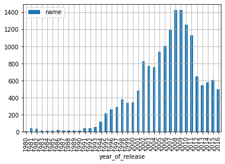
    


В 2008 и 2009 был настоящий "бум" по играм. в 2002 году игровая индустрия сделала настоящий скачок в развитии, зато в 2012 пользователя стало уже не так просто удивить, поэтому выпускаются игры реже, но более качественные - графика, сюжет, проработка лора.

### Теперь анализ по платформам

Воспользуемся тем же методом, что и в прошлом этапе - сводная таблица и график по ней


```python
data_games_platform=data.pivot_table(index='platform', values='total_sales', aggfunc='sum')
data_games_platform.plot(kind='bar',grid=True)
```


    <AxesSubplot:xlabel='platform'>


    
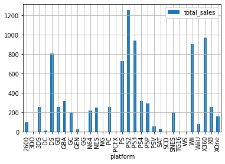
    


Абсолютные рекордсмены - DS и PS2. Сильно отстают от них, но все же лидируют, PS3, Wii и X360. Возьму их как топ-5 по суммарному количеству игр и построю распределение по годам.


```python
data_games_platform1=data.loc[data['platform'] == 'DS']
data_games_platform1pv=data_games_platform1.pivot_table(index='year_of_release', values='name', aggfunc='count')
data_games_platform1pv.plot(kind='bar',grid=True)
```


    <AxesSubplot:xlabel='year_of_release'>


    
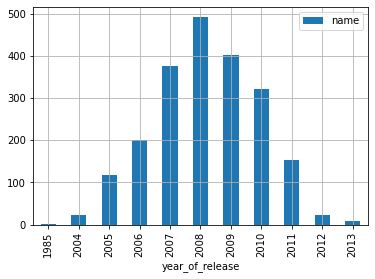
    


```python
data_games_platform2=data.loc[data['platform'] == 'PS2']
data_games_platform2pv=data_games_platform2.pivot_table(index='year_of_release', values='name', aggfunc='count')
data_games_platform2pv.plot(kind='bar',grid=True)
```


    <AxesSubplot:xlabel='year_of_release'>


    
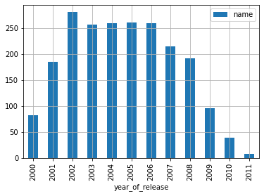
    


```python
data_games_platform3=data.loc[data['platform'] == 'PS3']
data_games_platform3pv=data_games_platform3.pivot_table(index='year_of_release', values='name', aggfunc='count')
data_games_platform3pv.plot(kind='bar',grid=True)
```


    <AxesSubplot:xlabel='year_of_release'>


    
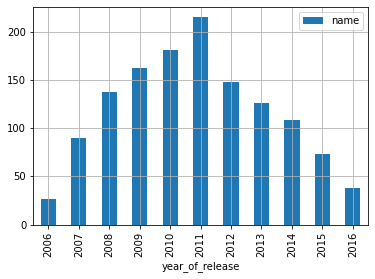
    


```python
data_games_platform4=data.loc[data['platform'] == 'Wii']
data_games_platform4pv=data_games_platform4.pivot_table(index='year_of_release', values='name', aggfunc='count')
data_games_platform4pv.plot(kind='bar',grid=True)
```


    <AxesSubplot:xlabel='year_of_release'>


    

    


```python
data_games_platform4=data.loc[data['platform'] == 'Wii']
data_games_platform4pv=data_games_platform4.pivot_table(index='year_of_release', values='name', aggfunc='count')
data_games_platform4pv.plot(kind='bar',grid=True)
```


    <AxesSubplot:xlabel='year_of_release'>


    
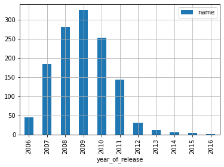
    


```python
data_games_platform5=data.loc[data['platform'] == 'X360']
data_games_platform5pv=data_games_platform5.pivot_table(index='year_of_release', values='name', aggfunc='count')
data_games_platform5pv.plot(kind='bar',grid=True)
```


    <AxesSubplot:xlabel='year_of_release'>


    
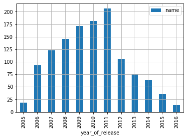
    


На платформе DS активно работали с 2005 по 2011
На PS2 - с 2000 по 2009
На PS3 - с 2007 по 2015
На Wii - с 2007 по 2011
На X360 - с 2006 по 2011, после которого пошел резкий спад. 
Найдем среднее для периода активности каждой платформы


```python
mean_active=(6+9+8+4+5)/5
mean_active
```


    6.4


То есть средний период популярности платформы примерно 6 лет. ОДНАКО актуальный период будет от него отличаться, поскольку за актуальный период я решила взять меньшую цифру - все указаные периоды попадают в одно окно - с 2007 по 2011, а это всего 4 года. поэтому за актуальный период примем это число и прогнозы будем строить на его основе. То есть для анализа возьмем данные с 2013 по 2016 включительно.


```python
df=data.loc[data['year_of_release'] >= 2013.0]
df.head()
```


<div>
<style scoped>
    .dataframe tbody tr th:only-of-type {
        vertical-align: middle;
    }

    .dataframe tbody tr th {
        vertical-align: top;
    }

    .dataframe thead th {
        text-align: right;
    }
</style>
<table border="1" class="dataframe">
  <thead>
    <tr style="text-align: right;">
      <th></th>
      <th>name</th>
      <th>platform</th>
      <th>year_of_release</th>
      <th>genre</th>
      <th>na_sales</th>
      <th>eu_sales</th>
      <th>jp_sales</th>
      <th>other_sales</th>
      <th>critic_score</th>
      <th>user_score</th>
      <th>rating</th>
      <th>total_sales</th>
    </tr>
  </thead>
  <tbody>
    <tr>
      <th>16</th>
      <td>Grand Theft Auto V</td>
      <td>PS3</td>
      <td>2013</td>
      <td>Action</td>
      <td>7.02</td>
      <td>9.09</td>
      <td>0.98</td>
      <td>3.96</td>
      <td>97.0</td>
      <td>8.2</td>
      <td>M</td>
      <td>21.05</td>
    </tr>
    <tr>
      <th>23</th>
      <td>Grand Theft Auto V</td>
      <td>X360</td>
      <td>2013</td>
      <td>Action</td>
      <td>9.66</td>
      <td>5.14</td>
      <td>0.06</td>
      <td>1.41</td>
      <td>97.0</td>
      <td>8.1</td>
      <td>M</td>
      <td>16.27</td>
    </tr>
    <tr>
      <th>31</th>
      <td>Call of Duty: Black Ops 3</td>
      <td>PS4</td>
      <td>2015</td>
      <td>Shooter</td>
      <td>6.03</td>
      <td>5.86</td>
      <td>0.36</td>
      <td>2.38</td>
      <td>NaN</td>
      <td>NaN</td>
      <td>no_rating</td>
      <td>14.63</td>
    </tr>
    <tr>
      <th>33</th>
      <td>Pokemon X/Pokemon Y</td>
      <td>3DS</td>
      <td>2013</td>
      <td>Role-Playing</td>
      <td>5.28</td>
      <td>4.19</td>
      <td>4.35</td>
      <td>0.78</td>
      <td>NaN</td>
      <td>NaN</td>
      <td>no_rating</td>
      <td>14.60</td>
    </tr>
    <tr>
      <th>42</th>
      <td>Grand Theft Auto V</td>
      <td>PS4</td>
      <td>2014</td>
      <td>Action</td>
      <td>3.96</td>
      <td>6.31</td>
      <td>0.38</td>
      <td>1.97</td>
      <td>97.0</td>
      <td>8.3</td>
      <td>M</td>
      <td>12.62</td>
    </tr>
  </tbody>
</table>
</div>


```python
data_sales_platform=df.pivot_table(index='platform', values='total_sales', aggfunc='sum')
data_sales_platform.plot(kind='bar',grid=True)
```


    <AxesSubplot:xlabel='platform'>


    
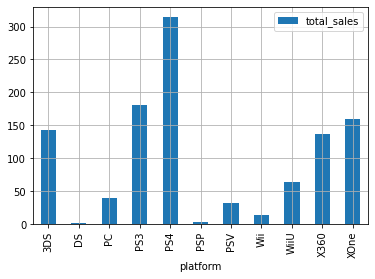
    


По количеству продаж однозначно лидируют PS4, PSV, PS3, 3DS и XOne. Но это только по количеству. Нужно также посмотреть динамику


```python
df1=df.loc[data['platform'] == 'PS4']
df1pv=df1.pivot_table(index='year_of_release', values='total_sales', aggfunc='sum')
df1pv.plot(kind='bar',grid=True)
```


    <AxesSubplot:xlabel='year_of_release'>


    
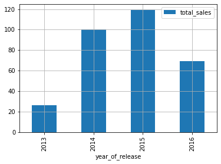
    


```python
df3=df.loc[data['platform'] == 'PS3']
df3pv=df3.pivot_table(index='year_of_release', values='total_sales', aggfunc='sum')
df3pv.plot(kind='bar',grid=True)
```


    <AxesSubplot:xlabel='year_of_release'>


    

    


```python
df2=df.loc[data['platform'] == 'PSV']
df2pv=df2.pivot_table(index='year_of_release', values='total_sales', aggfunc='sum')
df2pv.plot(kind='bar',grid=True)
```


    <AxesSubplot:xlabel='year_of_release'>


    
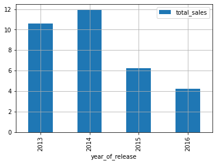
    


```python
df4=df.loc[data['platform'] == '3DS']
df4pv=df4.pivot_table(index='year_of_release', values='total_sales', aggfunc='sum')
df4pv.plot(kind='bar',grid=True)
```


    <AxesSubplot:xlabel='year_of_release'>


    
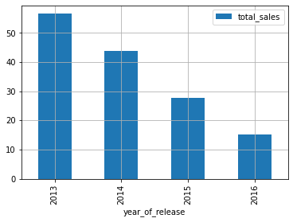
    


```python
df5=df.loc[data['platform'] == 'XOne']
df5pv=df5.pivot_table(index='year_of_release', values='total_sales', aggfunc='sum')
df5pv.plot(kind='bar',grid=True)
```


    <AxesSubplot:xlabel='year_of_release'>


    
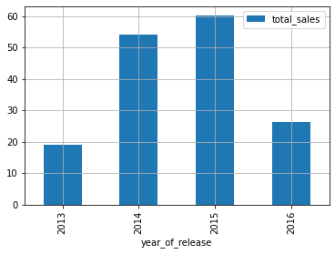
    


PS4 дает хорошую динамику в продажах, и, скорее всего, еще пару лет как минимум будет популярна. PS3 идет на спад, динамика явная и устойчивая, и, скорее всего, сохранится. PSV сначала набрала популярность, но к 16 году резко начала в ней терять. Разработчикам либо не нужно рисковать, выпуская новые игры на этой платформе, либо выпустить нечто потрясающее, что-то, что вернет пользователей на эту платформу. 3DS до 2015 года держалась стабильно, в 16 году заметен спад, поэтому мои выводы тут такие же, как и для пятой PS. А вот XOne показывает такой же устойчивый рост, как и четвертая playstation. Релиз игры на этой платформе даст минимальный риск провала в продажах. Конечно, наверняка есть зависимость продаж от оценок, но это тема дальнейшего исследования.

Построим "Боксплот" по глобальным продажам, по всем имеющимся платформам


```python
plt.figure(figsize=(12,6))
sb.boxplot(data=df, x='platform', y='total_sales', showfliers=False)
plt.ylim(0, .9) 
plt.title('Боксплот по продажам')
plt.xlabel('Платформы')
plt.ylabel('Продажи, млн')
```


    Text(0, 0.5, 'Продажи, млн')


    
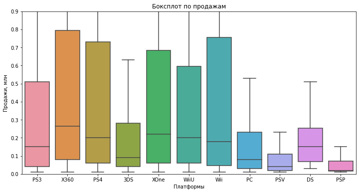
    


```python
plt.figure(figsize=(12,6))
sb.boxplot(x='platform', y='total_sales', data=df)
plt.title('Боксплот продаж по платформам 13-16')
plt.xlabel('Платформы')
plt.ylabel('Продажи, млн')
```


    Text(0, 0.5, 'Продажи, млн')


    
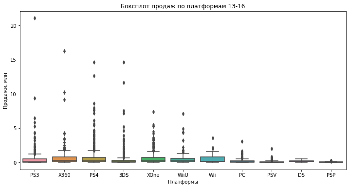
    


Данные сильно смещены, верхние квартили по всем платформам сильно больше нижних. Медиана по всем платформам не превышает 0,3 млн. Данные также неплотные, сильно рассеяны по графику. 
Выделяются PS3, X360, PS4, Xone, WiiU и Wii, т.к. у них самые высокие медианы и набор значений продаж сильно уходит вверх.

Посмотрим, как влияют на продажи внутри одной популярной платформы отзывы пользователей и критиков. Построим диаграмму рассеяния и посчитаем корреляцию между отзывами и продажами. Возьмем XOne


```python
df5['total_sales'].corr(df5['critic_score'])
```


    0.41699832800840175


```python
df5['total_sales'].corr(df5['user_score'])
```


    -0.06892505328279412


В случае с оценкой критиков коэффициент корреляции Пирсона положительный, во второй - отрицательный. Но достаточно близко к 1 и -1 эти значения не подошли. Мой вывод - у этой связи более сложный, не линейный характер. То есть, на продажи также должен влиять жанр и год выпуска, а также, возможно, регион проживания пользователя. Однако явно заметно, что оценка критиков все же имеет некоторое влияние на продажи. Построим диаграмму рассеяния на обе связи. 


```python
df5.plot(kind='scatter', x ='critic_score', y='total_sales', title='Корреляция продаж с оценками критиков XOne')
```


    <AxesSubplot:title={'center':'Корреляция продаж с оценками критиков XOne'}, xlabel='critic_score', ylabel='total_sales'>


    
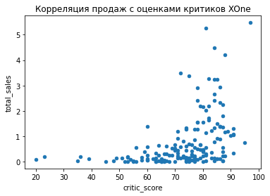
    


```python
df5.plot(kind='scatter', x ='user_score', y='total_sales', title='Корреляция продаж с оценками игроков XOne')
```


    <AxesSubplot:title={'center':'Корреляция продаж с оценками игроков XOne'}, xlabel='user_score', ylabel='total_sales'>


    
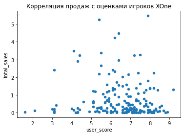
    


По диаграммам видно, что на XOne активнее всего покупают игры с оценкой критиков примерно от 63 до 87 баллов, а вот пользовательская оценка должна варьироваться от 7 до 9.

Посмотрим, сохраняется ли такая же картина на PS4


```python
df1['total_sales'].corr(df1['critic_score'])
```


    0.406567902061781


```python
df1['total_sales'].corr(df1['user_score'])
```


    -0.031957110204556376


```python
df1.plot(kind='scatter', x ='critic_score', y='total_sales', title='Корреляция продаж с оценками критиков PS4')
```


    <AxesSubplot:title={'center':'Корреляция продаж с оценками критиков PS4'}, xlabel='critic_score', ylabel='total_sales'>


    
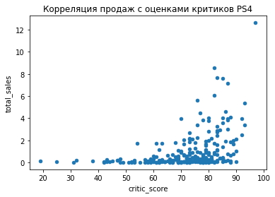
    


```python
df1.plot(kind='scatter', x ='user_score', y='total_sales', title='Корреляция продаж с оценками игроков PS4')
```


    <AxesSubplot:title={'center':'Корреляция продаж с оценками игроков PS4'}, xlabel='user_score', ylabel='total_sales'>


    
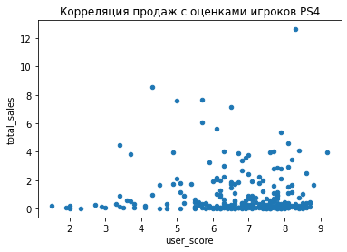
    


Вижу схожую с XOne картину, но разброс продаж шире -  с оценкой критиков примерно от 55 до 90 баллов, и пользовательская оценка варьируется от 5.5 до 8.7.

На очереди пятый плейстейшен, проверяем


```python
df2['total_sales'].corr(df2['critic_score'])
```


    0.25474235030686565


```python
df2['total_sales'].corr(df2['user_score'])
```


    0.0009424723319108626


```python
df2.plot(kind='scatter', x ='critic_score', y='total_sales', title='Корреляция продаж с оценками критиков PS5')
```


    <AxesSubplot:title={'center':'Корреляция продаж с оценками критиков PS5'}, xlabel='critic_score', ylabel='total_sales'>


    
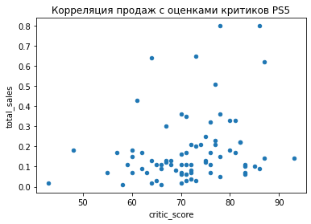
    


```python
df2.plot(kind='scatter', x ='user_score', y='total_sales', title='Корреляция продаж с оценками игроков PS5')
```


    <AxesSubplot:title={'center':'Корреляция продаж с оценками игроков PS5'}, xlabel='user_score', ylabel='total_sales'>


    
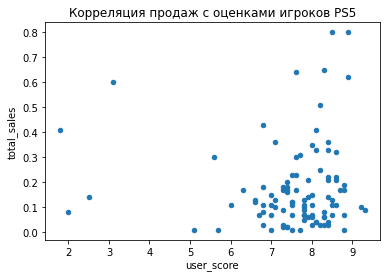
    


На пятой плойке оценки как критиков, так и пользователей на продажи влияют сильнее, чем на других платформах, по оценке критиков разброс довольно большой, от 55 до 87, но разброс в пользовательской оценке компактей - от 6.8 до 8.8. 

Третий плейстейшн:


```python
df3['total_sales'].corr(df3['critic_score'])
```


    0.3342853393371919


```python
df3['total_sales'].corr(df3['user_score'])
```


    0.0023944027357566925


```python
df3.plot(kind='scatter', x ='critic_score', y='total_sales', title='Корреляция продаж с оценками критиков PS3')
```


    <AxesSubplot:title={'center':'Корреляция продаж с оценками критиков PS3'}, xlabel='critic_score', ylabel='total_sales'>


    
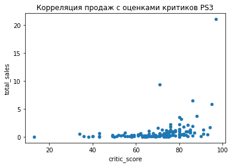
    


```python
df3.plot(kind='scatter', x ='user_score', y='total_sales', title='Корреляция продаж с оценками игроков PS3')
```


    <AxesSubplot:title={'center':'Корреляция продаж с оценками игроков PS3'}, xlabel='user_score', ylabel='total_sales'>


    
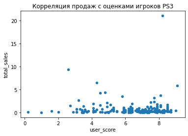
    


Влияние всех оценок крайне низкое, связи практически нет. редкие выбросы указывают на хорошо разрекламированные хиты. 

Посмотрим последнюю платформу из топа, это Нинтендо


```python
df4['total_sales'].corr(df4['critic_score'])
```


    0.35705661422881035


```python
df4['total_sales'].corr(df4['user_score'])
```


    0.24150411773563016


```python
df4.plot(kind='scatter', x ='critic_score', y='total_sales', title='Корреляция продаж с оценками критиков Nintendo')
```


    <AxesSubplot:title={'center':'Корреляция продаж с оценками критиков Nintendo'}, xlabel='critic_score', ylabel='total_sales'>


    
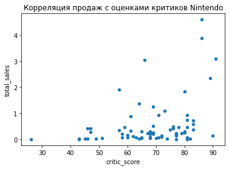
    


```python
df4.plot(kind='scatter', x ='user_score', y='total_sales', title='Корреляция продаж с оценками игроков Nintendo')
```


    <AxesSubplot:title={'center':'Корреляция продаж с оценками игроков Nintendo'}, xlabel='user_score', ylabel='total_sales'>


    
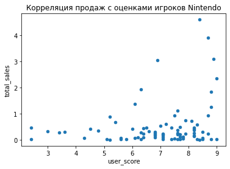
    


Тут связь самая сильная из всего топа платформ. Так как анализ к этому графику я дописываю уже после составления портрета среднего пользователя по регионам, то возьму смелость утверждать, что оценки критиков и пользователей здесь влияют сильнее всего на продажи как раз потому, что средний пользователь Нинтендо - японский подросток, на которого сильно влияют авторитеты и общественное мнение, особенно одобрение ровесников.

Посмотрим популярность по жанрам


```python
df_pv=df.pivot_table(index='genre', values='total_sales', aggfunc='median')
df_pv.plot(kind='bar',grid=True)
```


    <AxesSubplot:xlabel='genre'>


    
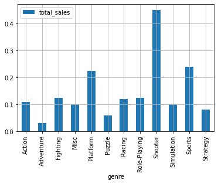
    


Шутеры бьют все рекорды популярности на всех платформах. На втором месте с огромным отрывом идут спортивные, потом - платформеры. Приключения тоже лидер, только с другой стороны ТОПа.

### Портрет пользователя каждого региона. 

Для того, чтобы составить портрет среднего пользователя по регионам, нам понадобятся три выборки по регионам. Сформируем три новых фрейма из актуальных данных и посмотрим зависимости - какая самая популярная платформа, жанр и влияние рейтинга ESRB на продажи. Для этого воспользуемся медианой


```python
region_sales_pv=df.pivot_table(index='genre', values=['na_sales', 'eu_sales', 'jp_sales'], aggfunc='median')
region_sales_pv.plot(kind='bar',grid=True, title='Популярность жанров по регионам')
```


    <AxesSubplot:title={'center':'Популярность жанров по регионам'}, xlabel='genre'>


    
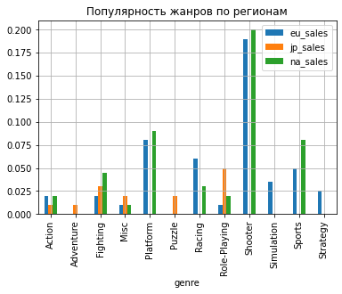
    


```python
region_platform_pv=df.pivot_table(index='platform', values=['na_sales', 'eu_sales', 'jp_sales'], aggfunc='median')
region_platform_pv.plot(kind='bar',grid=True, title='Популярность платформ по регионам')
```


    <AxesSubplot:title={'center':'Популярность платформ по регионам'}, xlabel='platform'>


    

    


```python
region_rating_pv=df.pivot_table(index='rating', values=['na_sales', 'eu_sales', 'jp_sales'], aggfunc=['median','sum'])
region_rating_pv.T.plot(kind='bar',grid=True, title='Продажи в регионах по рейтингу')
```


    <AxesSubplot:title={'center':'Продажи в регионах по рейтингу'}>


    
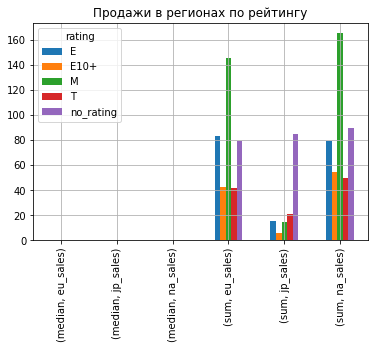
    


Вижу, тут не все критерии рейтинга, но в целом оценить можно. Игры с рейтингом "для взрослых" лидируют в Европе и Северной Америке. Что, впрочем, неудивительно с японским "культом продуктивности" для взрослых. На втором месте рейтинг "Е10+", который, согласно Википедии, маркирует игры, которые "могут содержать минимальное насилие, в основном «мультяшного» характера" но только не для самый маленьких и явно не относится к развивающим играм, только развлекательные. Такие игры помогают отвлечься, отдохнуть и разгрузить мозг. Заметно, что больше всего в Японии популярны игры для подростков или с пометкой "без рейтинга", в то время как в Северной Америке и Европе это наименее популярные игры. 

Итак, полученные данные позволяют составить портрет среднестатистического игрока по регионам.

Европа: На плейстейшн 4,WII, Искбокс - Европа самая разнообразная в плане платформ для игр. очевидно, что американские, что азиатские платформы популярны с практически незначительным разрывом. Думаю, имеет место личные предпочтения пользователей. Играют в основном в шутеры, платформеры и спорт, рейтинг игр "для взрослых". Тут все указывает на то, что люди играют, чтобы отвлечься, окунуться в другую реальность и просто хорошо провести время. 

Северная Америка: Подавляющее большинство - оба вида иксбокс, играют в те же жанры, что и в Европе, но больший процент пользователей отдает предпочтение шутерам. Как правило, этот жанр выбирают те, кто испытывает много стресса и сбрасывает его таким образом. 

В Японии же самая популярная платформа 3DS, она же Нинтендо. Довольно патриотично с их стороны, но думаю, тут еще дело в том, что Япония на островах, туда не очень удобно доставлять технику, произведенную в США (ну или в Китае, но все равно дороже), плюс ввиду менталитета японские игры гораздо специфичней европейских - более мультяшные, красочные, более динамичные и т.д., то есть вряд ли другие платформы будут удобны для реализации такого контента. Японская техника по качеству в некоторых вопросах даже превосходит европейскую, пользователи не будут переплачивать за то, что по качеству такое же или хуже. К тому же, в Японии популярны другие жанры - лидируют ролевые с рейтингом для подростков либо без рейтинга. То есть в Японии средний пользователь гораздо моложе, чем в Европе или Америке - там преобладает средний возраст.


```python
#Комментарий ревьювера
df.pivot_table(index='rating', values=['na_sales', 'eu_sales', 'jp_sales'], aggfunc=['median','sum'])
```


<div>
<style scoped>
    .dataframe tbody tr th:only-of-type {
        vertical-align: middle;
    }

    .dataframe tbody tr th {
        vertical-align: top;
    }

    .dataframe thead tr th {
        text-align: left;
    }

    .dataframe thead tr:last-of-type th {
        text-align: right;
    }
</style>
<table border="1" class="dataframe">
  <thead>
    <tr>
      <th></th>
      <th colspan="3" halign="left">median</th>
      <th colspan="3" halign="left">sum</th>
    </tr>
    <tr>
      <th></th>
      <th>eu_sales</th>
      <th>jp_sales</th>
      <th>na_sales</th>
      <th>eu_sales</th>
      <th>jp_sales</th>
      <th>na_sales</th>
    </tr>
    <tr>
      <th>rating</th>
      <th></th>
      <th></th>
      <th></th>
      <th></th>
      <th></th>
      <th></th>
    </tr>
  </thead>
  <tbody>
    <tr>
      <th>E</th>
      <td>0.055</td>
      <td>0.00</td>
      <td>0.05</td>
      <td>83.36</td>
      <td>15.14</td>
      <td>79.05</td>
    </tr>
    <tr>
      <th>E10+</th>
      <td>0.100</td>
      <td>0.00</td>
      <td>0.12</td>
      <td>42.69</td>
      <td>5.89</td>
      <td>54.24</td>
    </tr>
    <tr>
      <th>M</th>
      <td>0.130</td>
      <td>0.00</td>
      <td>0.14</td>
      <td>145.32</td>
      <td>14.11</td>
      <td>165.21</td>
    </tr>
    <tr>
      <th>T</th>
      <td>0.040</td>
      <td>0.01</td>
      <td>0.04</td>
      <td>41.95</td>
      <td>20.59</td>
      <td>49.79</td>
    </tr>
    <tr>
      <th>no_rating</th>
      <td>0.000</td>
      <td>0.02</td>
      <td>0.00</td>
      <td>78.91</td>
      <td>85.05</td>
      <td>89.42</td>
    </tr>
  </tbody>
</table>
</div>


### Проверка гипотез

Итак, у нас две гипотезы для проверки. Из каждой из этих двух гипотез нужно сформулировать нулевую и альтернативную гипотезу. Начну с первой, Которая звучит как "Средние пользовательские рейтинги платформ Xbox One и PC одинаковые".
Эту я приму за нулевую гипотезу, а альтернативная гипотеза, которая противоречит нулевой гипотезе, будет сформулирована так: "Средние пользовательские рейтинги платформы Xbox One и PC различаются".
Мы сформулировали нулевую и альтернативную гипотезу, остается только на основе данных сделать выбор: отклонить нулевую гипотезу в пользу альтернативной или нет. Для этого нужно посчитать вероятность получить наблюдаемое на выборке значение (в нашем случае - среднее) при условии, что нулевая гипотеза верна. Если вероятность большая — отвергать нулевую гипотезу мы не будем.
В данном случае получилась гипотеза о равенстве средних для парных выборок, значит, имеет смысл для её проверки воспользоваться t-тестом. 


```python
df_pc=df.loc[data['platform'] == 'PC'] #выбираем из актуальных данных платформу
pc_rating = df_pc['user_score'].dropna() #без удаления пропусков не получалось рассчитать p-value, была ошибка
df_xbox=df.loc[data['platform'] == 'XOne']#выбираем из актуальных данных платформу
xbox_rating = df_xbox['user_score'].dropna()


alpha = 0.05 # уровень статистической значимости


results = st.ttest_ind(pc_rating, xbox_rating)

print('p-значение:', results.pvalue)

if results.pvalue < alpha:
    print('Отвергаем нулевую гипотезу')

else:
    print('Не получилось отвергнуть нулевую гипотезу')
```

    p-значение: 0.14012658403611647
    Не получилось отвергнуть нулевую гипотезу


Итак, тест показал, что гипотеза верна. 

Займемся проверкой второй гипотезы. Нулевая гипотеза - "Средние пользовательские рейтинги жанров Action и Sports одинаковые".
Альтернативную гипотезу сформулируем так же, как и в первом случае - "Средние пользовательские рейтинги жанров Action и Sports разные"


```python
df_action=df.loc[data['genre'] == 'Action'] #выбираем из актуальных данных жанр
action_rating = df_action['user_score'].dropna() #без удаления пропусков не получалось рассчитать p-value, была ошибка
df_sports=df.loc[data['genre'] == 'Sports'] #выбираем из актуальных данных жанр
sports_rating = df_sports['user_score'].dropna() #без удаления пропусков не получалось рассчитать p-value, была ошибка


alpha = 0.05 # уровень статистической значимости


results = st.ttest_ind(action_rating, sports_rating)

print('p-значение:', results.pvalue)

if results.pvalue < alpha:
    print('Отвергаем нулевую гипотезу')
else:
    print('Не получилось отвергнуть нулевую гипотезу')
```

    p-значение: 1.0517832389140023e-27
    Отвергаем нулевую гипотезу


Гипотеза была отвергнута, притом с большим запасом.

### Общий вывод

Итак, в этом проекте я анализировала данные по играм, основными метриками были количество продаж, рейтинги и жанры. Сначала определила средний период популярности платформ,который составил 6 лет, также определила актуальный период для данных из области игр - 4 года.  По актуальной иформации делала прогнозы для современных платформ, определяла самые популярные жанры(шутеры, спортивные и платформеры) и платформы (PS4, PSV, PS3, 3DS и XOne) для разных регионов, составила портрет среднего пользователя по регионам и проверила две гипотезы. 

Портреты пользователей по регионам:
Европа: На плейстейшн 4,WII, Искбокс - Европа самая разнообразная в плане платформ для игр. очевидно, что американские, что азиатские платформы популярны с практически незначительным разрывом. Думаю, имеет место личные предпочтения пользователей. Играют в основном в шутеры, платформеры и спорт, рейтинг игр "для взрослых". Тут все указывает на то, что люди играют, чтобы отвлечься, окунуться в другую реальность и просто хорошо провести время. 

Северная Америка: Подавляющее большинство - оба вида иксбокс, играют в те же жанры, что и в Европе, но больший процент пользователей отдает предпочтение шутерам. Как правило, этот жанр выбирают те, кто испытывает много стресса и сбрасывает его таким образом. 

В Японии же самая популярная платформа 3DS, она же Нинтендо. Довольно патриотично с их стороны, но думаю, тут еще дело в том, что Япония на островах, туда не очень удобно доставлять технику, произведенную в США (ну или в Китае, но все равно дороже), плюс ввиду менталитета японские игры гораздо специфичней европейских - более мультяшные, красочные, более динамичные и т.д., то есть вряд ли другие платформы будут удобны для реализации такого контента. Японская техника по качеству в некоторых вопросах даже превосходит европейскую, пользователи не будут переплачивать за то, что по качеству такое же или хуже. К тому же, в Японии популярны другие жанры - лидируют ролевые с рейтингом для подростков либо без рейтинга. То есть в Японии средний пользователь гораздо моложе, чем в Европе или Америке - там преобладает средний возраст.

Популярность по рейтингам:
Игры с рейтингом "для взрослых" лидируют в Европе и Северной Америке.На втором месте рейтинг "Е10+". В Японии популярны игры для подростков или с пометкой "без рейтинга", в то время как в Северной Америке и Европе это наименее популярные игры. 

Влияние оценок критиков и пользоватетей на продажи незначительное во всех регионах за исключением Японии, где влияние прослеживается гораздо сильнее. Аномалия объясняется меньшим чем в других регионах средним возрастом пользователя. 


```python

```
