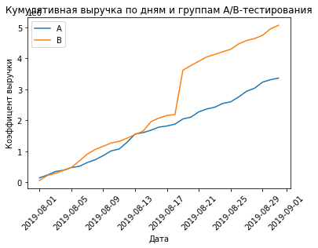
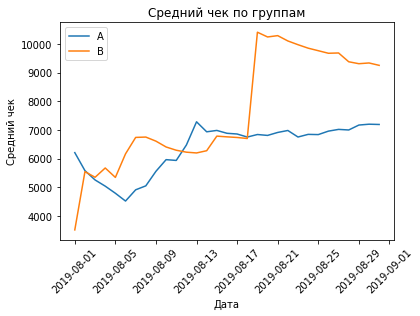
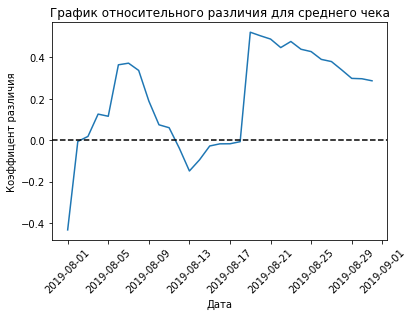
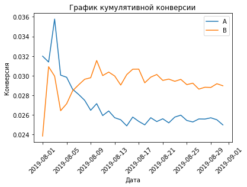
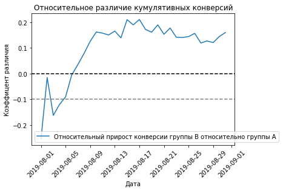
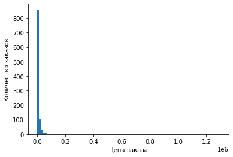
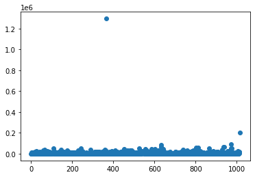
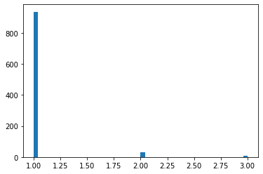
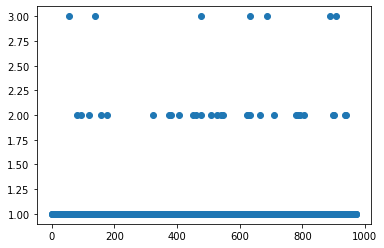

# Принятие решений в бизнесе
## Часть 1

В этом проекте мы будем проверять гипотезы для отдела маркетинга и приоритизировать их, а также анализировать результаты A/B-теста. Данные для первой части мы получим из одного датафрейма, для второго понадобятся два других. перед анализом данные нужно будет проверить на соответствие типам данных, аномалии, дубликаты - явные и неявные - и нулевые значения. Таким образом, работа будет состоять из нескольких этапов: 

Часть 1:
1)проверка данных
2)Применим фреймворк ICE для приоритизации гипотез. Отсортируем их по убыванию приоритета.
3)Применим фреймворк RICE для приоритизации гипотез. Отсортируем их по убыванию приоритета.
4)Рассмотрим, как изменилась приоритизация гипотез при применении RICE вместо ICE и причины изменений

### Подготовим данные

Начнем с импорта всех библиотек, которые нам пригодятся.


```python
import pandas as pd
import matplotlib.pyplot as plt
import scipy.stats as stats
import datetime as dt
import numpy as np
```


```python
hypothesis=pd.read_csv('/datasets/hypothesis.csv')
hypothesis
```


<div>
<style scoped>
    .dataframe tbody tr th:only-of-type {
        vertical-align: middle;
    }

    .dataframe tbody tr th {
        vertical-align: top;
    }

    .dataframe thead th {
        text-align: right;
    }
</style>
<table border="1" class="dataframe">
  <thead>
    <tr style="text-align: right;">
      <th></th>
      <th>Hypothesis</th>
      <th>Reach</th>
      <th>Impact</th>
      <th>Confidence</th>
      <th>Efforts</th>
    </tr>
  </thead>
  <tbody>
    <tr>
      <th>0</th>
      <td>Добавить два новых канала привлечения трафика,...</td>
      <td>3</td>
      <td>10</td>
      <td>8</td>
      <td>6</td>
    </tr>
    <tr>
      <th>1</th>
      <td>Запустить собственную службу доставки, что сок...</td>
      <td>2</td>
      <td>5</td>
      <td>4</td>
      <td>10</td>
    </tr>
    <tr>
      <th>2</th>
      <td>Добавить блоки рекомендаций товаров на сайт ин...</td>
      <td>8</td>
      <td>3</td>
      <td>7</td>
      <td>3</td>
    </tr>
    <tr>
      <th>3</th>
      <td>Изменить структура категорий, что увеличит кон...</td>
      <td>8</td>
      <td>3</td>
      <td>3</td>
      <td>8</td>
    </tr>
    <tr>
      <th>4</th>
      <td>Изменить цвет фона главной страницы, чтобы уве...</td>
      <td>3</td>
      <td>1</td>
      <td>1</td>
      <td>1</td>
    </tr>
    <tr>
      <th>5</th>
      <td>Добавить страницу отзывов клиентов о магазине,...</td>
      <td>3</td>
      <td>2</td>
      <td>2</td>
      <td>3</td>
    </tr>
    <tr>
      <th>6</th>
      <td>Показать на главной странице баннеры с актуаль...</td>
      <td>5</td>
      <td>3</td>
      <td>8</td>
      <td>3</td>
    </tr>
    <tr>
      <th>7</th>
      <td>Добавить форму подписки на все основные страни...</td>
      <td>10</td>
      <td>7</td>
      <td>8</td>
      <td>5</td>
    </tr>
    <tr>
      <th>8</th>
      <td>Запустить акцию, дающую скидку на товар в день...</td>
      <td>1</td>
      <td>9</td>
      <td>9</td>
      <td>5</td>
    </tr>
  </tbody>
</table>
</div>


визуально с таблицей все хорошо, только названия колонок привести к нижнему регистру для удобства.


```python
hypothesis.columns = hypothesis.columns.str.lower()
hypothesis
```


<div>
<style scoped>
    .dataframe tbody tr th:only-of-type {
        vertical-align: middle;
    }

    .dataframe tbody tr th {
        vertical-align: top;
    }

    .dataframe thead th {
        text-align: right;
    }
</style>
<table border="1" class="dataframe">
  <thead>
    <tr style="text-align: right;">
      <th></th>
      <th>hypothesis</th>
      <th>reach</th>
      <th>impact</th>
      <th>confidence</th>
      <th>efforts</th>
    </tr>
  </thead>
  <tbody>
    <tr>
      <th>0</th>
      <td>Добавить два новых канала привлечения трафика,...</td>
      <td>3</td>
      <td>10</td>
      <td>8</td>
      <td>6</td>
    </tr>
    <tr>
      <th>1</th>
      <td>Запустить собственную службу доставки, что сок...</td>
      <td>2</td>
      <td>5</td>
      <td>4</td>
      <td>10</td>
    </tr>
    <tr>
      <th>2</th>
      <td>Добавить блоки рекомендаций товаров на сайт ин...</td>
      <td>8</td>
      <td>3</td>
      <td>7</td>
      <td>3</td>
    </tr>
    <tr>
      <th>3</th>
      <td>Изменить структура категорий, что увеличит кон...</td>
      <td>8</td>
      <td>3</td>
      <td>3</td>
      <td>8</td>
    </tr>
    <tr>
      <th>4</th>
      <td>Изменить цвет фона главной страницы, чтобы уве...</td>
      <td>3</td>
      <td>1</td>
      <td>1</td>
      <td>1</td>
    </tr>
    <tr>
      <th>5</th>
      <td>Добавить страницу отзывов клиентов о магазине,...</td>
      <td>3</td>
      <td>2</td>
      <td>2</td>
      <td>3</td>
    </tr>
    <tr>
      <th>6</th>
      <td>Показать на главной странице баннеры с актуаль...</td>
      <td>5</td>
      <td>3</td>
      <td>8</td>
      <td>3</td>
    </tr>
    <tr>
      <th>7</th>
      <td>Добавить форму подписки на все основные страни...</td>
      <td>10</td>
      <td>7</td>
      <td>8</td>
      <td>5</td>
    </tr>
    <tr>
      <th>8</th>
      <td>Запустить акцию, дающую скидку на товар в день...</td>
      <td>1</td>
      <td>9</td>
      <td>9</td>
      <td>5</td>
    </tr>
  </tbody>
</table>
</div>


```python
hypothesis.info()
```

    <class 'pandas.core.frame.DataFrame'>
    RangeIndex: 9 entries, 0 to 8
    Data columns (total 5 columns):
     #   Column      Non-Null Count  Dtype 
    ---  ------      --------------  ----- 
     0   hypothesis  9 non-null      object
     1   reach       9 non-null      int64 
     2   impact      9 non-null      int64 
     3   confidence  9 non-null      int64 
     4   efforts     9 non-null      int64 
    dtypes: int64(4), object(1)
    memory usage: 488.0+ bytes


Дубликатов нет, с типами данных все в порядке, можно анализировать 

### Применим фреймворк ICE для приоритизации гипотез. Отсортируем их по убыванию приоритета.

Добавим в таблицу столбец ICE с расчетом приоритетности по формуле impact * confidence / efforts 


```python
hypothesis['ICE']= hypothesis['impact']*hypothesis['confidence']/hypothesis['efforts']
hypothesis=hypothesis.sort_values(by='ICE', ascending=False)
hypothesis
```


<div>
<style scoped>
    .dataframe tbody tr th:only-of-type {
        vertical-align: middle;
    }

    .dataframe tbody tr th {
        vertical-align: top;
    }

    .dataframe thead th {
        text-align: right;
    }
</style>
<table border="1" class="dataframe">
  <thead>
    <tr style="text-align: right;">
      <th></th>
      <th>hypothesis</th>
      <th>reach</th>
      <th>impact</th>
      <th>confidence</th>
      <th>efforts</th>
      <th>ICE</th>
    </tr>
  </thead>
  <tbody>
    <tr>
      <th>8</th>
      <td>Запустить акцию, дающую скидку на товар в день...</td>
      <td>1</td>
      <td>9</td>
      <td>9</td>
      <td>5</td>
      <td>16.200000</td>
    </tr>
    <tr>
      <th>0</th>
      <td>Добавить два новых канала привлечения трафика,...</td>
      <td>3</td>
      <td>10</td>
      <td>8</td>
      <td>6</td>
      <td>13.333333</td>
    </tr>
    <tr>
      <th>7</th>
      <td>Добавить форму подписки на все основные страни...</td>
      <td>10</td>
      <td>7</td>
      <td>8</td>
      <td>5</td>
      <td>11.200000</td>
    </tr>
    <tr>
      <th>6</th>
      <td>Показать на главной странице баннеры с актуаль...</td>
      <td>5</td>
      <td>3</td>
      <td>8</td>
      <td>3</td>
      <td>8.000000</td>
    </tr>
    <tr>
      <th>2</th>
      <td>Добавить блоки рекомендаций товаров на сайт ин...</td>
      <td>8</td>
      <td>3</td>
      <td>7</td>
      <td>3</td>
      <td>7.000000</td>
    </tr>
    <tr>
      <th>1</th>
      <td>Запустить собственную службу доставки, что сок...</td>
      <td>2</td>
      <td>5</td>
      <td>4</td>
      <td>10</td>
      <td>2.000000</td>
    </tr>
    <tr>
      <th>5</th>
      <td>Добавить страницу отзывов клиентов о магазине,...</td>
      <td>3</td>
      <td>2</td>
      <td>2</td>
      <td>3</td>
      <td>1.333333</td>
    </tr>
    <tr>
      <th>3</th>
      <td>Изменить структура категорий, что увеличит кон...</td>
      <td>8</td>
      <td>3</td>
      <td>3</td>
      <td>8</td>
      <td>1.125000</td>
    </tr>
    <tr>
      <th>4</th>
      <td>Изменить цвет фона главной страницы, чтобы уве...</td>
      <td>3</td>
      <td>1</td>
      <td>1</td>
      <td>1</td>
      <td>1.000000</td>
    </tr>
  </tbody>
</table>
</div>


Согласно способу приоретизации ICE, наиболее приоритетными являются нулевая, седьмая и восьмая гипотезы. Добавим еще одну вводную в формулу и посмотрим, как поменяется приоритет гипотез.

### Применим фреймворк RICE для приоритизации гипотез. Отсортируем их по убыванию приоритета.

Добавим в таблицу столбец RICE с расчетом приоритетности по формуле (reach * impact * confidence) / efforts 


```python
hypothesis['RICE']= hypothesis['reach']*hypothesis['impact']*hypothesis['confidence']/hypothesis['efforts']
hypothesis=hypothesis.sort_values(by='RICE', ascending=False)
hypothesis
```


<div>
<style scoped>
    .dataframe tbody tr th:only-of-type {
        vertical-align: middle;
    }

    .dataframe tbody tr th {
        vertical-align: top;
    }

    .dataframe thead th {
        text-align: right;
    }
</style>
<table border="1" class="dataframe">
  <thead>
    <tr style="text-align: right;">
      <th></th>
      <th>hypothesis</th>
      <th>reach</th>
      <th>impact</th>
      <th>confidence</th>
      <th>efforts</th>
      <th>ICE</th>
      <th>RICE</th>
    </tr>
  </thead>
  <tbody>
    <tr>
      <th>7</th>
      <td>Добавить форму подписки на все основные страни...</td>
      <td>10</td>
      <td>7</td>
      <td>8</td>
      <td>5</td>
      <td>11.200000</td>
      <td>112.0</td>
    </tr>
    <tr>
      <th>2</th>
      <td>Добавить блоки рекомендаций товаров на сайт ин...</td>
      <td>8</td>
      <td>3</td>
      <td>7</td>
      <td>3</td>
      <td>7.000000</td>
      <td>56.0</td>
    </tr>
    <tr>
      <th>0</th>
      <td>Добавить два новых канала привлечения трафика,...</td>
      <td>3</td>
      <td>10</td>
      <td>8</td>
      <td>6</td>
      <td>13.333333</td>
      <td>40.0</td>
    </tr>
    <tr>
      <th>6</th>
      <td>Показать на главной странице баннеры с актуаль...</td>
      <td>5</td>
      <td>3</td>
      <td>8</td>
      <td>3</td>
      <td>8.000000</td>
      <td>40.0</td>
    </tr>
    <tr>
      <th>8</th>
      <td>Запустить акцию, дающую скидку на товар в день...</td>
      <td>1</td>
      <td>9</td>
      <td>9</td>
      <td>5</td>
      <td>16.200000</td>
      <td>16.2</td>
    </tr>
    <tr>
      <th>3</th>
      <td>Изменить структура категорий, что увеличит кон...</td>
      <td>8</td>
      <td>3</td>
      <td>3</td>
      <td>8</td>
      <td>1.125000</td>
      <td>9.0</td>
    </tr>
    <tr>
      <th>1</th>
      <td>Запустить собственную службу доставки, что сок...</td>
      <td>2</td>
      <td>5</td>
      <td>4</td>
      <td>10</td>
      <td>2.000000</td>
      <td>4.0</td>
    </tr>
    <tr>
      <th>5</th>
      <td>Добавить страницу отзывов клиентов о магазине,...</td>
      <td>3</td>
      <td>2</td>
      <td>2</td>
      <td>3</td>
      <td>1.333333</td>
      <td>4.0</td>
    </tr>
    <tr>
      <th>4</th>
      <td>Изменить цвет фона главной страницы, чтобы уве...</td>
      <td>3</td>
      <td>1</td>
      <td>1</td>
      <td>1</td>
      <td>1.000000</td>
      <td>3.0</td>
    </tr>
  </tbody>
</table>
</div>


### Рассмотрим, как изменилась приоритизация гипотез при применении RICE вместо ICE и причины изменений

Седьмая гипотеза осталась в тройке самых приоритетных, как и нулевая, а вот восьмую заменила вторая. Я из этих двух способов в данном случае бы выбрала второй способ, поскольку он, в отличие от первого, учитывает, какое количество пользователей затронет проверка.

## Часть 2.

A/B тесты проведены, результаты их выгружены в файлы. Теперь моя задача - проанализировать эти результаты. Сначала прочитаем таблицы и визуально оценим данные, проверим их качество и соответстсвие типам данных,проверим стабильность кумулятивных метрик:


,  проверим на выбросы, подготовим к анализу результатов, потом проведем непосредственно сам анализ - с выбросами и без них. Нужные библиотеки уже импортированы, так что начнем сразу с прочтения файлов.


```python
orders=pd.read_csv('/datasets/orders.csv')
orders
```


<div>
<style scoped>
    .dataframe tbody tr th:only-of-type {
        vertical-align: middle;
    }

    .dataframe tbody tr th {
        vertical-align: top;
    }

    .dataframe thead th {
        text-align: right;
    }
</style>
<table border="1" class="dataframe">
  <thead>
    <tr style="text-align: right;">
      <th></th>
      <th>transactionId</th>
      <th>visitorId</th>
      <th>date</th>
      <th>revenue</th>
      <th>group</th>
    </tr>
  </thead>
  <tbody>
    <tr>
      <th>0</th>
      <td>3667963787</td>
      <td>3312258926</td>
      <td>2019-08-15</td>
      <td>1650</td>
      <td>B</td>
    </tr>
    <tr>
      <th>1</th>
      <td>2804400009</td>
      <td>3642806036</td>
      <td>2019-08-15</td>
      <td>730</td>
      <td>B</td>
    </tr>
    <tr>
      <th>2</th>
      <td>2961555356</td>
      <td>4069496402</td>
      <td>2019-08-15</td>
      <td>400</td>
      <td>A</td>
    </tr>
    <tr>
      <th>3</th>
      <td>3797467345</td>
      <td>1196621759</td>
      <td>2019-08-15</td>
      <td>9759</td>
      <td>B</td>
    </tr>
    <tr>
      <th>4</th>
      <td>2282983706</td>
      <td>2322279887</td>
      <td>2019-08-15</td>
      <td>2308</td>
      <td>B</td>
    </tr>
    <tr>
      <th>...</th>
      <td>...</td>
      <td>...</td>
      <td>...</td>
      <td>...</td>
      <td>...</td>
    </tr>
    <tr>
      <th>1192</th>
      <td>2662137336</td>
      <td>3733762160</td>
      <td>2019-08-14</td>
      <td>6490</td>
      <td>B</td>
    </tr>
    <tr>
      <th>1193</th>
      <td>2203539145</td>
      <td>370388673</td>
      <td>2019-08-14</td>
      <td>3190</td>
      <td>A</td>
    </tr>
    <tr>
      <th>1194</th>
      <td>1807773912</td>
      <td>573423106</td>
      <td>2019-08-14</td>
      <td>10550</td>
      <td>A</td>
    </tr>
    <tr>
      <th>1195</th>
      <td>1947021204</td>
      <td>1614305549</td>
      <td>2019-08-14</td>
      <td>100</td>
      <td>A</td>
    </tr>
    <tr>
      <th>1196</th>
      <td>3936777065</td>
      <td>2108080724</td>
      <td>2019-08-15</td>
      <td>202740</td>
      <td>B</td>
    </tr>
  </tbody>
</table>
<p>1197 rows × 5 columns</p>
</div>


```python
orders.info()
```

    <class 'pandas.core.frame.DataFrame'>
    RangeIndex: 1197 entries, 0 to 1196
    Data columns (total 5 columns):
     #   Column         Non-Null Count  Dtype 
    ---  ------         --------------  ----- 
     0   transactionId  1197 non-null   int64 
     1   visitorId      1197 non-null   int64 
     2   date           1197 non-null   object
     3   revenue        1197 non-null   int64 
     4   group          1197 non-null   object
    dtypes: int64(3), object(2)
    memory usage: 46.9+ KB


Нулевых значений нет, все названия в одном регистре, но не тот тип данных у даты. Исправляем


```python
orders['date'] = orders['date'].map(lambda x: dt.datetime.strptime(x, '%Y-%m-%d'))
```


```python
orders.info()
```

    <class 'pandas.core.frame.DataFrame'>
    RangeIndex: 1197 entries, 0 to 1196
    Data columns (total 5 columns):
     #   Column         Non-Null Count  Dtype         
    ---  ------         --------------  -----         
     0   transactionId  1197 non-null   int64         
     1   visitorId      1197 non-null   int64         
     2   date           1197 non-null   datetime64[ns]
     3   revenue        1197 non-null   int64         
     4   group          1197 non-null   object        
    dtypes: datetime64[ns](1), int64(3), object(1)
    memory usage: 46.9+ KB


```python
orders.isnull().sum()
```


    transactionId    0
    visitorId        0
    date             0
    revenue          0
    group            0
    dtype: int64


```python
orders.duplicated().sum()
```


    0


```python
orders['group'].nunique()
```


    2


Итак, мы выяснили, что групп у нас две - А и В.


```python
visitors=pd.read_csv('/datasets/visitors.csv')
visitors
```


<div>
<style scoped>
    .dataframe tbody tr th:only-of-type {
        vertical-align: middle;
    }

    .dataframe tbody tr th {
        vertical-align: top;
    }

    .dataframe thead th {
        text-align: right;
    }
</style>
<table border="1" class="dataframe">
  <thead>
    <tr style="text-align: right;">
      <th></th>
      <th>date</th>
      <th>group</th>
      <th>visitors</th>
    </tr>
  </thead>
  <tbody>
    <tr>
      <th>0</th>
      <td>2019-08-01</td>
      <td>A</td>
      <td>719</td>
    </tr>
    <tr>
      <th>1</th>
      <td>2019-08-02</td>
      <td>A</td>
      <td>619</td>
    </tr>
    <tr>
      <th>2</th>
      <td>2019-08-03</td>
      <td>A</td>
      <td>507</td>
    </tr>
    <tr>
      <th>3</th>
      <td>2019-08-04</td>
      <td>A</td>
      <td>717</td>
    </tr>
    <tr>
      <th>4</th>
      <td>2019-08-05</td>
      <td>A</td>
      <td>756</td>
    </tr>
    <tr>
      <th>...</th>
      <td>...</td>
      <td>...</td>
      <td>...</td>
    </tr>
    <tr>
      <th>57</th>
      <td>2019-08-27</td>
      <td>B</td>
      <td>720</td>
    </tr>
    <tr>
      <th>58</th>
      <td>2019-08-28</td>
      <td>B</td>
      <td>654</td>
    </tr>
    <tr>
      <th>59</th>
      <td>2019-08-29</td>
      <td>B</td>
      <td>531</td>
    </tr>
    <tr>
      <th>60</th>
      <td>2019-08-30</td>
      <td>B</td>
      <td>490</td>
    </tr>
    <tr>
      <th>61</th>
      <td>2019-08-31</td>
      <td>B</td>
      <td>718</td>
    </tr>
  </tbody>
</table>
<p>62 rows × 3 columns</p>
</div>


```python
visitors.info()
```

    <class 'pandas.core.frame.DataFrame'>
    RangeIndex: 62 entries, 0 to 61
    Data columns (total 3 columns):
     #   Column    Non-Null Count  Dtype 
    ---  ------    --------------  ----- 
     0   date      62 non-null     object
     1   group     62 non-null     object
     2   visitors  62 non-null     int64 
    dtypes: int64(1), object(2)
    memory usage: 1.6+ KB


То же, что и у предыдущей таблицы, исправляем


```python
visitors['date'] = visitors['date'].map(lambda x: dt.datetime.strptime(x, '%Y-%m-%d'))
```


```python
visitors.info()
```

    <class 'pandas.core.frame.DataFrame'>
    RangeIndex: 62 entries, 0 to 61
    Data columns (total 3 columns):
     #   Column    Non-Null Count  Dtype         
    ---  ------    --------------  -----         
     0   date      62 non-null     datetime64[ns]
     1   group     62 non-null     object        
     2   visitors  62 non-null     int64         
    dtypes: datetime64[ns](1), int64(1), object(1)
    memory usage: 1.6+ KB


```python
visitors.isnull().sum()
```


    date        0
    group       0
    visitors    0
    dtype: int64


```python
visitors['group'].nunique()
```


    2


```python
visitors.duplicated().sum()
```


    0


Посмотрим, сколько пользователей в каждой группе - по таблице с заказами;


```python
users_per_group = orders['group'].value_counts()
print(users_per_group)
```

    B    640
    A    557
    Name: group, dtype: int64


Посмотрим, не попадают ли какие-то пользователи в обе группы - по таблице с заказами. Пересечение групп может повлиять на результаты анализа.  В рамках нашего проекта в качестве практики можно попробовать исключить таких пользователей из заказов, но корректно исключить их из визитов не получится, так как данные в этом датасете агрегированы.


```python
users_group_A = orders[orders['group'] == 'A']['visitorId']
users_group_B = orders[orders['group'] == 'B']['visitorId']
intersection = np.intersect1d(users_group_A, users_group_B)

if len(intersection) == 0:
    print('Пользователи из групп A и B не пересекаются')
else:
    print('Обнаружены пользователи, которые попали в обе группы')

```

    Обнаружены пользователи, которые попали в обе группы


Чтобы исключить пользователей, которые попали в обе группы, можно воспользоваться методом isin() и передать ему список пользователей, которые нужно исключить:


```python
intersection = np.intersect1d(users_group_A, users_group_B)

orders = orders[~orders['visitorId'].isin(intersection)]

```

Чтобы построить графики, нужно собрать кумулятивные данные. Объявим датафрейм cumulativeData со столбцами: 
date — дата;

group — группа A/B-теста (A или B);

orders — кумулятивное количество заказов на указанную дату в указанной группе;

buyers — кумулятивное количество пользователей, совершивших хотя бы один заказ, на указанную дату в указанной группе;

revenue — кумулятивная выручка на указанную дату в указанной группе (средний чек);

visitors — кумулятивное количество посетителей интернет-магазина на указанную дату в определённой группе.

Создадим массив уникальных пар значений дат и групп теста


```python
datesGroups = orders[['date','group']].drop_duplicates() 
```

Соберём агрегированные кумулятивные по дням данные о заказах в несколько действий. 
Получим строки таблицы orders, дата которых меньше или равна дате элемента из datesGroups, а группа теста равна группе из datesGroups:

Агрегируем значения. Вычислим максимальную и минимальную дату. Для группы тоже рассчитаем максимум, и хотя она будет определённой, сделаем это, чтобы столбец 'group' не пропал из итогового вывода. Найдём число уникальных ID заказов и пользователей. Подсчитаем сумму средних чеков:


```python
ordersAggregated = datesGroups.apply(lambda x: orders[np.logical_and(orders['date'] <= x['date'], orders['group'] == x['group'])]\
.agg({'date' : 'max', 'group' : 'max', 'transactionId' : 'nunique', 'visitorId' : 'nunique', 'revenue' : 'sum'}), axis=1).sort_values(by=['date','group'])
ordersAggregated.head()

```


<div>
<style scoped>
    .dataframe tbody tr th:only-of-type {
        vertical-align: middle;
    }

    .dataframe tbody tr th {
        vertical-align: top;
    }

    .dataframe thead th {
        text-align: right;
    }
</style>
<table border="1" class="dataframe">
  <thead>
    <tr style="text-align: right;">
      <th></th>
      <th>date</th>
      <th>group</th>
      <th>transactionId</th>
      <th>visitorId</th>
      <th>revenue</th>
    </tr>
  </thead>
  <tbody>
    <tr>
      <th>55</th>
      <td>2019-08-01</td>
      <td>A</td>
      <td>23</td>
      <td>19</td>
      <td>142779</td>
    </tr>
    <tr>
      <th>66</th>
      <td>2019-08-01</td>
      <td>B</td>
      <td>17</td>
      <td>17</td>
      <td>59758</td>
    </tr>
    <tr>
      <th>175</th>
      <td>2019-08-02</td>
      <td>A</td>
      <td>42</td>
      <td>36</td>
      <td>234381</td>
    </tr>
    <tr>
      <th>173</th>
      <td>2019-08-02</td>
      <td>B</td>
      <td>40</td>
      <td>39</td>
      <td>221801</td>
    </tr>
    <tr>
      <th>291</th>
      <td>2019-08-03</td>
      <td>A</td>
      <td>66</td>
      <td>60</td>
      <td>346854</td>
    </tr>
  </tbody>
</table>
</div>


```python
ordersAggregated['date'].min()

```


    Timestamp('2019-08-01 00:00:00')


```python
ordersAggregated['date'].max()
```


    Timestamp('2019-08-31 00:00:00')


Аналогично получим агрегированные кумулятивные по дням данные о посетителях интернет-магазина: 


```python
visitorsAggregated = datesGroups.apply(lambda x: visitors[np.logical_and(visitors['date'] <= x['date'], visitors['group'] == x['group'])].agg({'date' : 'max', 'group' : 'max', 'visitors' : 'sum'}), axis=1).sort_values(by=['date','group'])
```

объединяем кумулятивные данные в одной таблице и присваиваем ее столбцам понятные названия


```python
cumulativeData = ordersAggregated.merge(visitorsAggregated, left_on=['date', 'group'], right_on=['date', 'group'])
cumulativeData.columns = ['date', 'group', 'orders', 'buyers', 'revenue', 'visitors']

print(cumulativeData.head(5)) 
```

            date group  orders  buyers  revenue  visitors
    0 2019-08-01     A      23      19   142779       719
    1 2019-08-01     B      17      17    59758       713
    2 2019-08-02     A      42      36   234381      1338
    3 2019-08-02     B      40      39   221801      1294
    4 2019-08-03     A      66      60   346854      1845


Построим графики кумулятивной выручки по дням и группам A/B-тестирования: 


```python
# датафрейм с кумулятивным количеством заказов и кумулятивной выручкой по дням в группе А
cumulativeRevenueA = cumulativeData[cumulativeData['group']=='A'][['date','revenue', 'orders']]

# датафрейм с кумулятивным количеством заказов и кумулятивной выручкой по дням в группе B
cumulativeRevenueB = cumulativeData[cumulativeData['group']=='B'][['date','revenue', 'orders']]

# Строим график выручки группы А
plt.plot(cumulativeRevenueA['date'], cumulativeRevenueA['revenue'], label='A')

# Строим график выручки группы B
plt.plot(cumulativeRevenueB['date'], cumulativeRevenueB['revenue'], label='B')
plt.xticks(rotation = 45)
plt.legend() 
plt.title('Кумулятивная выручка по дням и группам A/B-тестирования')
plt.xlabel('Дата')
plt.ylabel('Коэффицент выручки')
plt.show()
```


    

    


Выручка почти равномерно увеличивается в течение всего теста. Хороший знак.
Однако графики выручки группы В в одной точке резко растёт. Это может сигнализировать о всплесках числа заказов, либо о появлении очень дорогих заказов в выборке. Такие выбросы проанализируем в следующем шаге.
Построим графики среднего чека по группам — разделим кумулятивную выручку на кумулятивное число заказов:


```python
plt.plot(cumulativeRevenueA['date'], cumulativeRevenueA['revenue']/cumulativeRevenueA['orders'], label='A')
plt.plot(cumulativeRevenueB['date'], cumulativeRevenueB['revenue']/cumulativeRevenueB['orders'], label='B')
plt.xticks(rotation = 45)
plt.legend()
plt.title('Средний чек по группам')
plt.xlabel('Дата')
plt.ylabel('Средний чек')
plt.show()
```


    

    


Средний чек тоже становится равномерным ближе к концу теста: установился для группы A и продолжает падать для группы B. Возможно, в группу B в первой половине теста попали крупные заказы (резкий всплеск на графике). Тогда ей нужно больше данных, чтобы прийти к реальному среднему чеку и установиться на его уровне.
Построим график относительного различия для среднего чека. 


```python
# собираем данные в одном датафрейме
mergedCumulativeRevenue = cumulativeRevenueA.merge(cumulativeRevenueB, left_on='date', right_on='date', how='left', suffixes=['A', 'B'])

# cтроим отношение средних чеков
plt.plot(mergedCumulativeRevenue['date'], (mergedCumulativeRevenue['revenueB']/mergedCumulativeRevenue['ordersB'])/(mergedCumulativeRevenue['revenueA']/mergedCumulativeRevenue['ordersA'])-1)
plt.xticks(rotation = 45)
# добавляем ось X
plt.axhline(y=0, color='black', linestyle='--')

plt.title('График относительного различия для среднего чека')
plt.xlabel('Дата')
plt.ylabel('Коэффицент различия')
plt.show()
```


    

    


В нескольких точках график различия между сегментами резко «скачет». Точно есть крупные заказы и выбросы.

Аналогично проанализируем график кумулятивной конверсии.


```python
# считаем кумулятивную конверсию
cumulativeData['conversion'] = cumulativeData['orders']/cumulativeData['visitors']

# отделяем данные по группе A
cumulativeDataA = cumulativeData[cumulativeData['group']=='A']

# отделяем данные по группе B
cumulativeDataB = cumulativeData[cumulativeData['group']=='B']

# строим графики
plt.plot(cumulativeDataA['date'], cumulativeDataA['conversion'], label='A')
plt.plot(cumulativeDataB['date'], cumulativeDataB['conversion'], label='B')
plt.xticks(rotation = 45)
plt.legend()
plt.title('График кумулятивной конверсии')
plt.xlabel('Дата')
plt.ylabel('Конверсия')
# задаем масштаб осей
#plt.axis([2019-08-01, 2019-09-01, 0, 0.015])
plt.show()
```


    

    


Группы подскочили и обе стали падать, но затем конверсия группы В вырвалась вперёд и зафиксировалась, а конверсия группы А просела и продолжила падать.
Построим график относительного различия кумулятивных конверсий:


```python
mergedCumulativeConversions = cumulativeDataA[['date','conversion']].merge(cumulativeDataB[['date','conversion']], left_on='date', right_on='date', how='left', suffixes=['A', 'B'])

plt.plot(mergedCumulativeConversions['date'], mergedCumulativeConversions['conversionB']/mergedCumulativeConversions['conversionA']-1, label="Относительный прирост конверсии группы B относительно группы A")
plt.xticks(rotation = 45)
plt.legend()
plt.title('Относительное различие кумулятивных конверсий')
plt.xlabel('Дата')
plt.ylabel('Коэффицент различия')
plt.axhline(y=0, color='black', linestyle='--')
plt.axhline(y=-0.1, color='grey', linestyle='--')
#plt.axis(["2019-08-01", '2019-09-01', -0.6, 0.6])
plt.show()
```


    

    


В начале теста группа B значительно проигрывала группе A, затем вырвалась вперёд. 
В целом отношение конверсии ещё не установилось, и сейчас делать какие-либо выводы по тесту нельзя. Впрочем, сперва стоит проанализировать аномалии, возможно, они изменят картину. 


```python
plt.hist(orders['revenue'], bins=100)
plt.xlabel('Цена заказа')
plt.ylabel('Количество заказов')
plt.show()
```


    

    


```python
print(orders['revenue'])
```

    0         1650
    1          730
    3         9759
    4         2308
    5         2210
             ...  
    1191     16490
    1192      6490
    1193      3190
    1194     10550
    1196    202740
    Name: revenue, Length: 1016, dtype: int64


```python
x_values = pd.Series(range(0,len(orders['revenue'])))
plt.scatter(x_values, orders['revenue']) 
```


    <matplotlib.collections.PathCollection at 0x7f45281ce760>


    

    


```python
orders=orders.sort_values(by='revenue', ascending=False)
orders.head(15)
```


<div>
<style scoped>
    .dataframe tbody tr th:only-of-type {
        vertical-align: middle;
    }

    .dataframe tbody tr th {
        vertical-align: top;
    }

    .dataframe thead th {
        text-align: right;
    }
</style>
<table border="1" class="dataframe">
  <thead>
    <tr style="text-align: right;">
      <th></th>
      <th>transactionId</th>
      <th>visitorId</th>
      <th>date</th>
      <th>revenue</th>
      <th>group</th>
    </tr>
  </thead>
  <tbody>
    <tr>
      <th>425</th>
      <td>590470918</td>
      <td>1920142716</td>
      <td>2019-08-19</td>
      <td>1294500</td>
      <td>B</td>
    </tr>
    <tr>
      <th>1196</th>
      <td>3936777065</td>
      <td>2108080724</td>
      <td>2019-08-15</td>
      <td>202740</td>
      <td>B</td>
    </tr>
    <tr>
      <th>1136</th>
      <td>666610489</td>
      <td>1307669133</td>
      <td>2019-08-13</td>
      <td>92550</td>
      <td>A</td>
    </tr>
    <tr>
      <th>744</th>
      <td>3668308183</td>
      <td>888512513</td>
      <td>2019-08-27</td>
      <td>86620</td>
      <td>B</td>
    </tr>
    <tr>
      <th>743</th>
      <td>3603576309</td>
      <td>4133034833</td>
      <td>2019-08-09</td>
      <td>67990</td>
      <td>A</td>
    </tr>
    <tr>
      <th>1103</th>
      <td>1348774318</td>
      <td>1164614297</td>
      <td>2019-08-12</td>
      <td>66350</td>
      <td>A</td>
    </tr>
    <tr>
      <th>1099</th>
      <td>316924019</td>
      <td>148427295</td>
      <td>2019-08-12</td>
      <td>65710</td>
      <td>A</td>
    </tr>
    <tr>
      <th>949</th>
      <td>1347999392</td>
      <td>887908475</td>
      <td>2019-08-21</td>
      <td>60450</td>
      <td>A</td>
    </tr>
    <tr>
      <th>940</th>
      <td>2420050534</td>
      <td>4003628586</td>
      <td>2019-08-08</td>
      <td>58550</td>
      <td>B</td>
    </tr>
    <tr>
      <th>131</th>
      <td>3163614039</td>
      <td>2254586615</td>
      <td>2019-08-22</td>
      <td>53904</td>
      <td>A</td>
    </tr>
    <tr>
      <th>287</th>
      <td>587872075</td>
      <td>2254456485</td>
      <td>2019-08-24</td>
      <td>53904</td>
      <td>A</td>
    </tr>
    <tr>
      <th>613</th>
      <td>4071177889</td>
      <td>3931967268</td>
      <td>2019-08-07</td>
      <td>53904</td>
      <td>B</td>
    </tr>
    <tr>
      <th>1006</th>
      <td>1861540412</td>
      <td>2261934787</td>
      <td>2019-08-10</td>
      <td>52900</td>
      <td>A</td>
    </tr>
    <tr>
      <th>1142</th>
      <td>3815014015</td>
      <td>2606908679</td>
      <td>2019-08-13</td>
      <td>52900</td>
      <td>B</td>
    </tr>
    <tr>
      <th>1137</th>
      <td>2183069967</td>
      <td>759473111</td>
      <td>2019-08-13</td>
      <td>52480</td>
      <td>A</td>
    </tr>
  </tbody>
</table>
</div>


Нашлось два выброса, очень дорогих, которые явно смажут картину, а еще это точно уложится в 1% данных, которые мы можем позволить себе потерять. Но сначала посмотрим средние чеки по перцентилям

Определим 90, 95 и 99 перцентили среднего чека в выборке:


```python
print(np.percentile(orders['revenue'], [90, 95, 99])) 
```

    [17990. 26785. 53904.]


Не более 5% заказов дороже 26785 рублей и не более 1% дороже 53904 рубля

Оценим также конверсию по пользователям


```python
ordersByUsers = (
    orders.groupby('visitorId', as_index=False)
    .agg({'transactionId': 'nunique'})
)

ordersByUsers.columns = ['visitorId', 'transactionId']

print(ordersByUsers.sort_values(by='transactionId', ascending=False).head(10)) 
```

          visitorId  transactionId
    908  3967698036              3
    55    249864742              3
    478  2108163459              3
    687  2988190573              3
    890  3908431265              3
    138   611059232              3
    632  2742574263              3
    157   678354126              2
    323  1404560065              2
    452  1985475298              2


Есть пользователи, которые совершали 3 и 2 заказа. Значительно больше, чем обычный пользователь.
Построим гистрограмму распределения количества заказов на одного пользователя.


```python
plt.hist(ordersByUsers['transactionId'], bins=50) 
```


    (array([937.,   0.,   0.,   0.,   0.,   0.,   0.,   0.,   0.,   0.,   0.,
              0.,   0.,   0.,   0.,   0.,   0.,   0.,   0.,   0.,   0.,   0.,
              0.,   0.,   0.,  29.,   0.,   0.,   0.,   0.,   0.,   0.,   0.,
              0.,   0.,   0.,   0.,   0.,   0.,   0.,   0.,   0.,   0.,   0.,
              0.,   0.,   0.,   0.,   0.,   7.]),
     array([1.  , 1.04, 1.08, 1.12, 1.16, 1.2 , 1.24, 1.28, 1.32, 1.36, 1.4 ,
            1.44, 1.48, 1.52, 1.56, 1.6 , 1.64, 1.68, 1.72, 1.76, 1.8 , 1.84,
            1.88, 1.92, 1.96, 2.  , 2.04, 2.08, 2.12, 2.16, 2.2 , 2.24, 2.28,
            2.32, 2.36, 2.4 , 2.44, 2.48, 2.52, 2.56, 2.6 , 2.64, 2.68, 2.72,
            2.76, 2.8 , 2.84, 2.88, 2.92, 2.96, 3.  ]),
     <BarContainer object of 50 artists>)


    

    


Большинство покупателей заказывали только один раз. Меньше - 2 раза. Однако доля пользователей с 3 заказами тоже значительна. Построим точечную диаграмму числа заказов на одного пользователя


```python
x_values = pd.Series(range(0,len(ordersByUsers)))

plt.scatter(x_values, ordersByUsers['transactionId']) 
```


    <matplotlib.collections.PathCollection at 0x7f45283d2d60>


    

    


Выводы подтверждаются: много пользователей с 3 заказами. Их точная доля не ясна — непонятно, считать их аномалиями или нет. 
Посчитаем выборочные перцентили количества заказов на одного пользователя:


```python
print(np.percentile(ordersByUsers['transactionId'], [90, 95, 99])) 
```

    [1. 1. 2.]


Не более 1% пользователей оформляли больше чем 2 заказа. 
Разумно выбрать 1 заказ на одного пользователя за верхнюю границу числа заказов, и отсеять аномальных пользователей по ней.

### Приступим к анализу А/B теста

Посчитаем статистическую значимость различий в среднем числе заказов на пользователя и среднем чеке между группами по «сырым» данным — без удаления аномальных пользователей. Потом удалим аномалии, если таковые найдутся, и посмотрим то же самое без них.
Сформулируем гипотезы. Нулевая: различий в среднем количестве заказов между группами нет. Альтернативная: различия в среднем количестве заказов между группами есть.

Начнём с подготовки данных. Создадим таблицу data, которая объединит две предыдущие таблицы с результатами и поделит их на группы. Состав таблицы:

ordersPerDateA — количество заказов в выбранную дату в группе A;

revenuePerDateA — суммарная выручка в выбранную дату в группе A;

ordersPerDateB — количество заказов в выбранную дату в группе B;

revenuePerDateB — суммарная выручка в выбранную дату в группе B;

ordersCummulativeA — суммарное число заказов до выбранной даты включительно в группе A;

revenueCummulativeA — суммарная выручка до выбранной даты включительно в группе A;

ordersCummulativeB — суммарное количество заказов до выбранной даты включительно в группе B;

revenueCummulativeB — суммарная выручка до выбранной даты включительно в группе B;

visitorsPerDateA — количество пользователей в выбранную дату в группе A;

visitorsPerDateB — количество пользователей в выбранную дату в группе B;

visitorsCummulativeA — количество пользователей до выбранной даты включительно в группе A;

visitorsCummulativeB — количество пользователей до выбранной даты включительно в группе B.


```python
visitorsADaily = visitors[visitors['group'] == 'A'][['date', 'visitors']]
visitorsADaily.columns = ['date', 'visitorsPerDateA']

visitorsACummulative = visitorsADaily.apply(
    lambda x: visitorsADaily[visitorsADaily['date'] <= x['date']].agg(
        {'date': 'max', 'visitorsPerDateA': 'sum'}
    ),
    axis=1,
)
visitorsACummulative.columns = ['date', 'visitorsCummulativeA']

visitorsBDaily = visitors[visitors['group'] == 'B'][['date', 'visitors']]
visitorsBDaily.columns = ['date', 'visitorsPerDateB']

visitorsBCummulative = visitorsBDaily.apply(
    lambda x: visitorsBDaily[visitorsBDaily['date'] <= x['date']].agg(
        {'date': 'max', 'visitorsPerDateB': 'sum'}
    ),
    axis=1,
)
visitorsBCummulative.columns = ['date', 'visitorsCummulativeB']

ordersADaily = (
    orders[orders['group'] == 'A'][['date', 'transactionId', 'visitorId', 'revenue']]
    .groupby('date', as_index=False)
    .agg({'transactionId': pd.Series.nunique, 'revenue': 'sum'})
)
ordersADaily.columns = ['date', 'ordersPerDateA', 'revenuePerDateA']

ordersACummulative = ordersADaily.apply(
    lambda x: ordersADaily[ordersADaily['date'] <= x['date']].agg(
        {'date': 'max', 'ordersPerDateA': 'sum', 'revenuePerDateA': 'sum'}
    ),
    axis=1,
).sort_values(by=['date'])
ordersACummulative.columns = [
    'date',
    'ordersCummulativeA',
    'revenueCummulativeA',
]

ordersBDaily = (
    orders[orders['group'] == 'B'][['date', 'transactionId', 'visitorId', 'revenue']]
    .groupby('date', as_index=False)
    .agg({'transactionId': pd.Series.nunique, 'revenue': 'sum'})
)
ordersBDaily.columns = ['date', 'ordersPerDateB', 'revenuePerDateB']

ordersBCummulative = ordersBDaily.apply(
    lambda x: ordersBDaily[ordersBDaily['date'] <= x['date']].agg(
        {'date': 'max', 'ordersPerDateB': 'sum', 'revenuePerDateB': 'sum'}
    ),
    axis=1,
).sort_values(by=['date'])
ordersBCummulative.columns = [
    'date',
    'ordersCummulativeB',
    'revenueCummulativeB',
]

data = (
    ordersADaily.merge(
        ordersBDaily, left_on='date', right_on='date', how='left'
    )
    .merge(ordersACummulative, left_on='date', right_on='date', how='left')
    .merge(ordersBCummulative, left_on='date', right_on='date', how='left')
    .merge(visitorsADaily, left_on='date', right_on='date', how='left')
    .merge(visitorsBDaily, left_on='date', right_on='date', how='left')
    .merge(visitorsACummulative, left_on='date', right_on='date', how='left')
    .merge(visitorsBCummulative, left_on='date', right_on='date', how='left')
)

print(data.head(5))
```

            date  ordersPerDateA  revenuePerDateA  ordersPerDateB  \
    0 2019-08-01              23           142779              17   
    1 2019-08-02              19            91602              23   
    2 2019-08-03              24           112473              14   
    3 2019-08-04              11            41176              14   
    4 2019-08-05              22            86383              21   
    
       revenuePerDateB  ordersCummulativeA  revenueCummulativeA  \
    0            59758                  23               142779   
    1           162043                  42               234381   
    2            67049                  66               346854   
    3            96890                  77               388030   
    4            89908                  99               474413   
    
       ordersCummulativeB  revenueCummulativeB  visitorsPerDateA  \
    0                  17                59758               719   
    1                  40               221801               619   
    2                  54               288850               507   
    3                  68               385740               717   
    4                  89               475648               756   
    
       visitorsPerDateB  visitorsCummulativeA  visitorsCummulativeB  
    0               713                   719                   713  
    1               581                  1338                  1294  
    2               509                  1845                  1803  
    3               770                  2562                  2573  
    4               707                  3318                  3280  


Посчитаем статистическую значимость различия в среднем количестве заказов между группами.
Создадим переменные ordersByUsersA и ordersByUsersB со столбцами ['visitorId', 'transactionId']. В них для пользователей, которые заказывали хотя бы 1 раз, укажем число совершённых заказов. 


```python
ordersByUsersA = (
    orders[orders['group'] == 'A']
    .groupby('visitorId', as_index=False)
    .agg({'transactionId': pd.Series.nunique})
)
ordersByUsersA.columns = ['visitorId', 'orders']

ordersByUsersB = (
    orders[orders['group'] == 'B']
    .groupby('visitorId', as_index=False)
    .agg({'transactionId': pd.Series.nunique})
)
ordersByUsersB.columns = ['visitorId', 'orders']
```

Объявим переменные sampleA и sampleB, в которых пользователям из разных групп будет соответствовать количество заказов. Тем, кто ничего не заказал, будут соответствовать нули. Чтобы получить среднее число заказов на пользователя, поделим сумму заказов на число пользователей — найдём среднее в выборке sampleA методом mean(). Аналогично найдём среднее группы B: SampleB.mean().
Выведем относительный прирост среднего числа заказов группы B: среднее число заказов группы B / среднее число заказов группы A -1. Округлим до трёх знаков после запятой

И выдвинем гипотезы - нулевую и альтернативную. 
Н0 - Среднее число заказов А и В не отличаются
Н1 - Среднее число заказов А и В отличаются


```python
sampleA = pd.concat(
    [
        ordersByUsersA['orders'],
        pd.Series(
            0,
            index=np.arange(
                data['visitorsPerDateA'].sum() - len(ordersByUsersA['orders'])
            ),
            name='orders',
        ),
    ],
    axis=0,
)

sampleB = pd.concat(
    [
        ordersByUsersB['orders'],
        pd.Series(
            0,
            index=np.arange(
                data['visitorsPerDateB'].sum() - len(ordersByUsersB['orders'])
            ),
            name='orders',
        ),
    ],
    axis=0,
)

print("{0:.3f}".format(stats.mannwhitneyu(sampleA, sampleB)[1]))

print("{0:.3f}".format(sampleB.mean() / sampleA.mean() - 1))
```

    0.011
    0.160


Вывод: По «сырым» данным различия в среднем числе заказов групп A и B есть. 

P-value значительно меньше 0.05. Значит, нулевую гипотезу о том, что статистически значимых различий в среднем числе заказов между группами нет, отвергаем.

Теперь проверим статистическую значимость различий в среднем чеке между сегментами. Нулевая гипотеза: различий в среднем чеке между группами нет. Альтернативная гипотеза: различия в среднем чеке между группами есть. 


```python
print('{0:.3f}'.format(stats.mannwhitneyu(orders[orders['group']=='A']['revenue'], orders[orders['group']=='B']['revenue'])[1]))
print('{0:.3f}'.format(orders[orders['group']=='B']['revenue'].mean()/orders[orders['group']=='A']['revenue'].mean()-1))
```

    0.829
    0.287


Первое число — p-value = 0.829 больше 0.05. Значит, нулевую гипотезу о том, что статистически значимых различий в среднем чеке  между группами нет, не отвергаем. 

Примем за аномальных пользователей тех, кто совершил от 2 заказов или совершил заказ дороже 26 000 рублей. Так мы уберём 5% пользователей с наибольшим числом заказов и от 1% до 5% пользователей с дорогими заказами. Сделаем срезы пользователей с числом заказов больше или равным 2 — usersWithManyOrders и пользователей, совершивших заказы дороже 26 000 — usersWithExpensiveOrders. Объединим их в таблице abnormalUsers. 
Узнаем, сколько всего аномальных пользователей атрибутом shape.


```python
usersWithManyOrders = pd.concat(
    [
        ordersByUsersA[ordersByUsersA['orders'] >= 2]['visitorId'],
        ordersByUsersB[ordersByUsersB['orders'] >= 2]['visitorId'],
    ],
    axis=0,
)
usersWithExpensiveOrders = orders[orders['revenue'] > 26000]['visitorId']
abnormalUsers = (
    pd.concat([usersWithManyOrders, usersWithExpensiveOrders], axis=0)
    .drop_duplicates()
    .sort_values()
)
print(abnormalUsers.head(5))
print(abnormalUsers.shape[0]) 
```

    568     113298937
    1099    148427295
    461     154576532
    928     204675465
    33      249864742
    Name: visitorId, dtype: int64
    89


Аномальных пользователей 89. 
Узнаем, как их действия повлияли на результаты теста. Посчитаем статистическую значимость различий в среднем количестве заказов между группами теста по очищенным данным. Сначала подготовим выборки количества заказов по пользователям по группам теста:


```python
sampleAFiltered = pd.concat(
    [
        ordersByUsersA[
            np.logical_not(ordersByUsersA['visitorId'].isin(abnormalUsers))
        ]['orders'],
        pd.Series(
            0,
            index=np.arange(
                data['visitorsPerDateA'].sum() - len(ordersByUsersA['orders'])
            ),
            name='orders',
        ),
    ],
    axis=0,
)

sampleBFiltered = pd.concat(
    [
        ordersByUsersB[
            np.logical_not(ordersByUsersB['visitorId'].isin(abnormalUsers))
        ]['orders'],
        pd.Series(
            0,
            index=np.arange(
                data['visitorsPerDateB'].sum() - len(ordersByUsersB['orders'])
            ),
            name='orders',
        ),
    ],
    axis=0,
) 
```

Теперь гипотезы можно проверять снов, по очищенным данным:

Н0 - Среднее число заказов А и В не отличаются

Н1 - Среднее число заказов А и В отличаются

Применим статистический критерий Манна-Уитни к полученным выборкам:


```python
print('{0:.3f}'.format(stats.mannwhitneyu(sampleAFiltered, sampleBFiltered)[1]))
print('{0:.3f}'.format(sampleBFiltered.mean()/sampleAFiltered.mean()-1)) 
```

    0.017
    0.172


Результаты по среднему количеству заказов практически не изменились. Проверим результаты по среднему чеку.

Нулевая гипотеза: различий в среднем чеке между группами нет. Альтернативная гипотеза: различия в среднем чеке между группами есть. 


```python
print(
    '{0:.3f}'.format(
        stats.mannwhitneyu(
            orders[
                np.logical_and(
                    orders['group'] == 'A',
                    np.logical_not(orders['visitorId'].isin(abnormalUsers)),
                )
            ]['revenue'],
            orders[
                np.logical_and(
                    orders['group'] == 'B',
                    np.logical_not(orders['visitorId'].isin(abnormalUsers)),
                )
            ]['revenue'],
        )[1]
    )
)

print(
    "{0:.3f}".format(
        orders[
            np.logical_and(
                orders['group'] == 'B',
                np.logical_not(orders['visitorId'].isin(abnormalUsers)),
            )
        ]['revenue'].mean()
        / orders[
            np.logical_and(
                orders['group'] == 'A',
                np.logical_not(orders['visitorId'].isin(abnormalUsers)),
            )
        ]['revenue'].mean()
        - 1
    )
)
```

    0.693
    -0.042


Стоило выбросить аномалии, как средний чек группы B сильно поменялся. Сейчас видно, что средний чек группы В сильно уменьшился, поскольку самые дорогие заказы в основном попали в группу В и смазали картину.

Имеющиеся факты:
Есть статистически значимое различие по среднему количеству заказов между группами и по «сырым», и по данным после фильтрации аномалий;
Есть статистически значимое различие по среднему чеку между группами по данным после фильтрации аномалий;

Исходя из обнаруженных фактов, тест следует остановить и признать его неуспешным. Продолжать смысла нет, потому как вероятность, что при имеющихся данных сегмент B на самом деле лучше сегмента A — практически нулевая. Кроме того, на результаты теста влияет тот факт, что мы не смогли удалить пользователей, которые попали в обе группы из файла visitors.


```python

```
