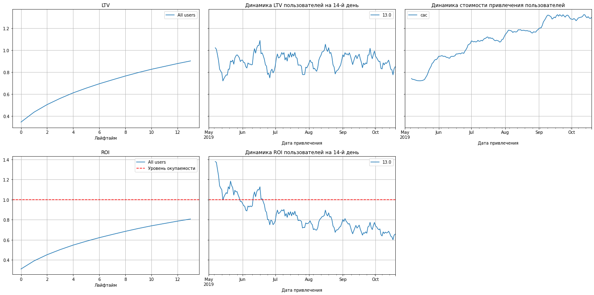
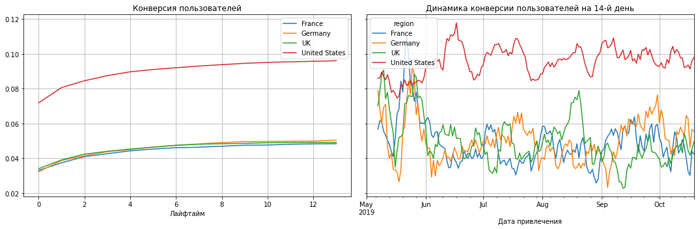
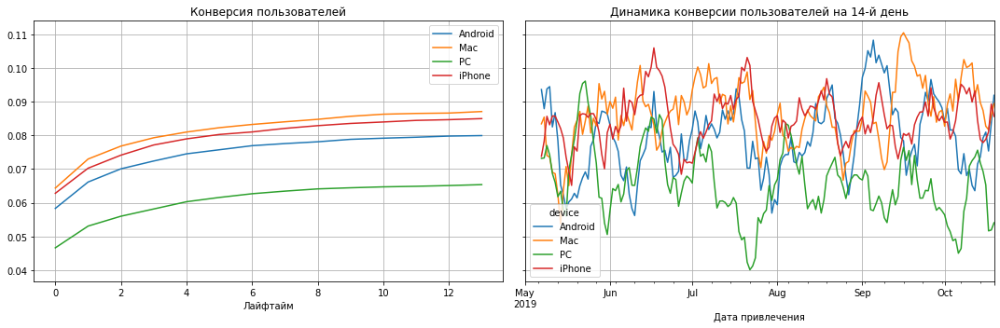

# Маркетинговый анализ развлекательного приложения Procrastinate Pro+


### Цель исследования:
1.	Рассчитать показатели: конверсию, коэффициент отскока, затраты на рекламу, пожизненную ценность клиента и прибыльность рекламной кампании
2.	Вывести рекомендации для маркетологов и построить дальнейшую стратегию продаж
### Ход исследования:
Данные я получу из трех файлов. Нужно будет провести первичную оценку качества данных, проверку их на ошибки. После нужно будет написать функции для автоматизации маркетингового анализа и визуализации его результатов, провести исследовательский анализ данных, рассчитать маркетинговые показатели с помощью ранее написанных функций, провести маркетинговый анализ и, исходя из результатов, сформировать дальнейшую рекламную стратегию.
Таким образом, анализ данных пройдет в несколько этапов:
•	Обзор данных
•	Предобработка данных
•	Написание функций
•	Исследовательский анализ данных
•	Расчет маркетинговых показателей
•	Маркетинговый анализ с визуализацией
•	Написание общего вывода 

### Загрузим данные и подготови их к анализу

Загрузим данные о визитах, заказах и рекламных расходах из CSV-файлов в переменные.

**Пути к файлам**

- визиты: `/datasets/visits_info_short.csv`. [Скачать датасет](https://code.s3.yandex.net/datasets/visits_info_short.csv);
- заказы: `/datasets/orders_info_short.csv`. [Скачать датасет](https://code.s3.yandex.net/datasets/orders_info_short.csv);
- расходы: `/datasets/costs_info_short.csv`. [Скачать датасет](https://code.s3.yandex.net/datasets/costs_info_short.csv).

Изучим данные и выполним предобработку. Проверим, есть ли в данных пропуски и дубликаты, убедимся, что типы данных во всех колонках соответствуют сохранённым в них значениям.


```python
import pandas as pd
import numpy as np
from datetime import datetime, timedelta
from matplotlib import pyplot as plt
import seaborn as sns
#импортируем нужные библиотеки
```


```python
visits = pd.read_csv('/datasets/visits_info_short.csv')#читаем файл
```


```python
display(visits.head(10))
```


<div>
<style scoped>
    .dataframe tbody tr th:only-of-type {
        vertical-align: middle;
    }

    .dataframe tbody tr th {
        vertical-align: top;
    }

    .dataframe thead th {
        text-align: right;
    }
</style>
<table border="1" class="dataframe">
  <thead>
    <tr style="text-align: right;">
      <th></th>
      <th>User Id</th>
      <th>Region</th>
      <th>Device</th>
      <th>Channel</th>
      <th>Session Start</th>
      <th>Session End</th>
    </tr>
  </thead>
  <tbody>
    <tr>
      <th>0</th>
      <td>981449118918</td>
      <td>United States</td>
      <td>iPhone</td>
      <td>organic</td>
      <td>2019-05-01 02:36:01</td>
      <td>2019-05-01 02:45:01</td>
    </tr>
    <tr>
      <th>1</th>
      <td>278965908054</td>
      <td>United States</td>
      <td>iPhone</td>
      <td>organic</td>
      <td>2019-05-01 04:46:31</td>
      <td>2019-05-01 04:47:35</td>
    </tr>
    <tr>
      <th>2</th>
      <td>590706206550</td>
      <td>United States</td>
      <td>Mac</td>
      <td>organic</td>
      <td>2019-05-01 14:09:25</td>
      <td>2019-05-01 15:32:08</td>
    </tr>
    <tr>
      <th>3</th>
      <td>326433527971</td>
      <td>United States</td>
      <td>Android</td>
      <td>TipTop</td>
      <td>2019-05-01 00:29:59</td>
      <td>2019-05-01 00:54:25</td>
    </tr>
    <tr>
      <th>4</th>
      <td>349773784594</td>
      <td>United States</td>
      <td>Mac</td>
      <td>organic</td>
      <td>2019-05-01 03:33:35</td>
      <td>2019-05-01 03:57:40</td>
    </tr>
    <tr>
      <th>5</th>
      <td>90242400005</td>
      <td>United States</td>
      <td>iPhone</td>
      <td>RocketSuperAds</td>
      <td>2019-05-01 07:14:52</td>
      <td>2019-05-01 08:19:56</td>
    </tr>
    <tr>
      <th>6</th>
      <td>43958116050</td>
      <td>United States</td>
      <td>Android</td>
      <td>organic</td>
      <td>2019-05-01 09:03:21</td>
      <td>2019-05-01 10:08:39</td>
    </tr>
    <tr>
      <th>7</th>
      <td>185365244969</td>
      <td>United States</td>
      <td>iPhone</td>
      <td>organic</td>
      <td>2019-05-01 09:37:03</td>
      <td>2019-05-01 10:00:43</td>
    </tr>
    <tr>
      <th>8</th>
      <td>446013509831</td>
      <td>United States</td>
      <td>iPhone</td>
      <td>RocketSuperAds</td>
      <td>2019-05-01 10:26:00</td>
      <td>2019-05-01 10:59:17</td>
    </tr>
    <tr>
      <th>9</th>
      <td>100970711362</td>
      <td>United States</td>
      <td>Mac</td>
      <td>TipTop</td>
      <td>2019-05-01 04:39:53</td>
      <td>2019-05-01 04:57:05</td>
    </tr>
  </tbody>
</table>
</div>


По правилу красивого кода стоит привести заголовки к нижнему регистру и пробелы из названий убрать.


```python
visits.columns = visits.columns.str.lower()
visits.rename(columns = {'user id':'user_id', 'session start':'session_start', 'session end':'session_end'}, inplace = True )
```


```python
display(visits.head(10))
```


<div>
<style scoped>
    .dataframe tbody tr th:only-of-type {
        vertical-align: middle;
    }

    .dataframe tbody tr th {
        vertical-align: top;
    }

    .dataframe thead th {
        text-align: right;
    }
</style>
<table border="1" class="dataframe">
  <thead>
    <tr style="text-align: right;">
      <th></th>
      <th>user_id</th>
      <th>region</th>
      <th>device</th>
      <th>channel</th>
      <th>session_start</th>
      <th>session_end</th>
    </tr>
  </thead>
  <tbody>
    <tr>
      <th>0</th>
      <td>981449118918</td>
      <td>United States</td>
      <td>iPhone</td>
      <td>organic</td>
      <td>2019-05-01 02:36:01</td>
      <td>2019-05-01 02:45:01</td>
    </tr>
    <tr>
      <th>1</th>
      <td>278965908054</td>
      <td>United States</td>
      <td>iPhone</td>
      <td>organic</td>
      <td>2019-05-01 04:46:31</td>
      <td>2019-05-01 04:47:35</td>
    </tr>
    <tr>
      <th>2</th>
      <td>590706206550</td>
      <td>United States</td>
      <td>Mac</td>
      <td>organic</td>
      <td>2019-05-01 14:09:25</td>
      <td>2019-05-01 15:32:08</td>
    </tr>
    <tr>
      <th>3</th>
      <td>326433527971</td>
      <td>United States</td>
      <td>Android</td>
      <td>TipTop</td>
      <td>2019-05-01 00:29:59</td>
      <td>2019-05-01 00:54:25</td>
    </tr>
    <tr>
      <th>4</th>
      <td>349773784594</td>
      <td>United States</td>
      <td>Mac</td>
      <td>organic</td>
      <td>2019-05-01 03:33:35</td>
      <td>2019-05-01 03:57:40</td>
    </tr>
    <tr>
      <th>5</th>
      <td>90242400005</td>
      <td>United States</td>
      <td>iPhone</td>
      <td>RocketSuperAds</td>
      <td>2019-05-01 07:14:52</td>
      <td>2019-05-01 08:19:56</td>
    </tr>
    <tr>
      <th>6</th>
      <td>43958116050</td>
      <td>United States</td>
      <td>Android</td>
      <td>organic</td>
      <td>2019-05-01 09:03:21</td>
      <td>2019-05-01 10:08:39</td>
    </tr>
    <tr>
      <th>7</th>
      <td>185365244969</td>
      <td>United States</td>
      <td>iPhone</td>
      <td>organic</td>
      <td>2019-05-01 09:37:03</td>
      <td>2019-05-01 10:00:43</td>
    </tr>
    <tr>
      <th>8</th>
      <td>446013509831</td>
      <td>United States</td>
      <td>iPhone</td>
      <td>RocketSuperAds</td>
      <td>2019-05-01 10:26:00</td>
      <td>2019-05-01 10:59:17</td>
    </tr>
    <tr>
      <th>9</th>
      <td>100970711362</td>
      <td>United States</td>
      <td>Mac</td>
      <td>TipTop</td>
      <td>2019-05-01 04:39:53</td>
      <td>2019-05-01 04:57:05</td>
    </tr>
  </tbody>
</table>
</div>


```python
visits.info()
```

    <class 'pandas.core.frame.DataFrame'>
    RangeIndex: 309901 entries, 0 to 309900
    Data columns (total 6 columns):
     #   Column         Non-Null Count   Dtype 
    ---  ------         --------------   ----- 
     0   user_id        309901 non-null  int64 
     1   region         309901 non-null  object
     2   device         309901 non-null  object
     3   channel        309901 non-null  object
     4   session_start  309901 non-null  object
     5   session_end    309901 non-null  object
    dtypes: int64(1), object(5)
    memory usage: 14.2+ MB


Пропусков нет, уже хорошо. но у начала и окончания сессий нужен тип данных datetime, а не object


```python
visits['session_start']=pd.to_datetime(visits['session_start'])
visits['session_end']=pd.to_datetime(visits['session_end'])
```


```python
visits.info()
```

    <class 'pandas.core.frame.DataFrame'>
    RangeIndex: 309901 entries, 0 to 309900
    Data columns (total 6 columns):
     #   Column         Non-Null Count   Dtype         
    ---  ------         --------------   -----         
     0   user_id        309901 non-null  int64         
     1   region         309901 non-null  object        
     2   device         309901 non-null  object        
     3   channel        309901 non-null  object        
     4   session_start  309901 non-null  datetime64[ns]
     5   session_end    309901 non-null  datetime64[ns]
    dtypes: datetime64[ns](2), int64(1), object(3)
    memory usage: 14.2+ MB


Проверим дубликаты


```python
visits.duplicated().sum()
```


    0


```python
orders = pd.read_csv('/datasets/orders_info_short.csv')
```


```python
display(orders.head(10))
```


<div>
<style scoped>
    .dataframe tbody tr th:only-of-type {
        vertical-align: middle;
    }

    .dataframe tbody tr th {
        vertical-align: top;
    }

    .dataframe thead th {
        text-align: right;
    }
</style>
<table border="1" class="dataframe">
  <thead>
    <tr style="text-align: right;">
      <th></th>
      <th>User Id</th>
      <th>Event Dt</th>
      <th>Revenue</th>
    </tr>
  </thead>
  <tbody>
    <tr>
      <th>0</th>
      <td>188246423999</td>
      <td>2019-05-01 23:09:52</td>
      <td>4.99</td>
    </tr>
    <tr>
      <th>1</th>
      <td>174361394180</td>
      <td>2019-05-01 12:24:04</td>
      <td>4.99</td>
    </tr>
    <tr>
      <th>2</th>
      <td>529610067795</td>
      <td>2019-05-01 11:34:04</td>
      <td>4.99</td>
    </tr>
    <tr>
      <th>3</th>
      <td>319939546352</td>
      <td>2019-05-01 15:34:40</td>
      <td>4.99</td>
    </tr>
    <tr>
      <th>4</th>
      <td>366000285810</td>
      <td>2019-05-01 13:59:51</td>
      <td>4.99</td>
    </tr>
    <tr>
      <th>5</th>
      <td>129100331057</td>
      <td>2019-05-01 01:56:28</td>
      <td>4.99</td>
    </tr>
    <tr>
      <th>6</th>
      <td>626807144131</td>
      <td>2019-05-01 02:39:21</td>
      <td>4.99</td>
    </tr>
    <tr>
      <th>7</th>
      <td>914062168985</td>
      <td>2019-05-01 02:02:18</td>
      <td>4.99</td>
    </tr>
    <tr>
      <th>8</th>
      <td>769669137453</td>
      <td>2019-05-01 03:39:47</td>
      <td>4.99</td>
    </tr>
    <tr>
      <th>9</th>
      <td>434198630691</td>
      <td>2019-05-01 18:16:50</td>
      <td>5.99</td>
    </tr>
  </tbody>
</table>
</div>


```python
orders.info()
```

    <class 'pandas.core.frame.DataFrame'>
    RangeIndex: 40212 entries, 0 to 40211
    Data columns (total 3 columns):
     #   Column    Non-Null Count  Dtype  
    ---  ------    --------------  -----  
     0   User Id   40212 non-null  int64  
     1   Event Dt  40212 non-null  object 
     2   Revenue   40212 non-null  float64
    dtypes: float64(1), int64(1), object(1)
    memory usage: 942.6+ KB


тут, очевидно, те же проблемы, что и  в первом фрейме. повторим те же шаги


```python
orders.columns = orders.columns.str.lower()
orders.rename(columns = {'user id':'user_id', 'event dt':'event_dt'}, inplace = True )
orders['event_dt']=pd.to_datetime(orders['event_dt'])
```

Проверим внешний вид


```python
orders.info()
```

    <class 'pandas.core.frame.DataFrame'>
    RangeIndex: 40212 entries, 0 to 40211
    Data columns (total 3 columns):
     #   Column    Non-Null Count  Dtype         
    ---  ------    --------------  -----         
     0   user_id   40212 non-null  int64         
     1   event_dt  40212 non-null  datetime64[ns]
     2   revenue   40212 non-null  float64       
    dtypes: datetime64[ns](1), float64(1), int64(1)
    memory usage: 942.6 KB


```python
display(orders.head())
```


<div>
<style scoped>
    .dataframe tbody tr th:only-of-type {
        vertical-align: middle;
    }

    .dataframe tbody tr th {
        vertical-align: top;
    }

    .dataframe thead th {
        text-align: right;
    }
</style>
<table border="1" class="dataframe">
  <thead>
    <tr style="text-align: right;">
      <th></th>
      <th>user_id</th>
      <th>event_dt</th>
      <th>revenue</th>
    </tr>
  </thead>
  <tbody>
    <tr>
      <th>0</th>
      <td>188246423999</td>
      <td>2019-05-01 23:09:52</td>
      <td>4.99</td>
    </tr>
    <tr>
      <th>1</th>
      <td>174361394180</td>
      <td>2019-05-01 12:24:04</td>
      <td>4.99</td>
    </tr>
    <tr>
      <th>2</th>
      <td>529610067795</td>
      <td>2019-05-01 11:34:04</td>
      <td>4.99</td>
    </tr>
    <tr>
      <th>3</th>
      <td>319939546352</td>
      <td>2019-05-01 15:34:40</td>
      <td>4.99</td>
    </tr>
    <tr>
      <th>4</th>
      <td>366000285810</td>
      <td>2019-05-01 13:59:51</td>
      <td>4.99</td>
    </tr>
  </tbody>
</table>
</div>


```python
orders.duplicated().sum()
```


    0


```python
costs = pd.read_csv('/datasets/costs_info_short.csv')
```


```python
display(costs.head(10))
```


<div>
<style scoped>
    .dataframe tbody tr th:only-of-type {
        vertical-align: middle;
    }

    .dataframe tbody tr th {
        vertical-align: top;
    }

    .dataframe thead th {
        text-align: right;
    }
</style>
<table border="1" class="dataframe">
  <thead>
    <tr style="text-align: right;">
      <th></th>
      <th>dt</th>
      <th>Channel</th>
      <th>costs</th>
    </tr>
  </thead>
  <tbody>
    <tr>
      <th>0</th>
      <td>2019-05-01</td>
      <td>FaceBoom</td>
      <td>113.3</td>
    </tr>
    <tr>
      <th>1</th>
      <td>2019-05-02</td>
      <td>FaceBoom</td>
      <td>78.1</td>
    </tr>
    <tr>
      <th>2</th>
      <td>2019-05-03</td>
      <td>FaceBoom</td>
      <td>85.8</td>
    </tr>
    <tr>
      <th>3</th>
      <td>2019-05-04</td>
      <td>FaceBoom</td>
      <td>136.4</td>
    </tr>
    <tr>
      <th>4</th>
      <td>2019-05-05</td>
      <td>FaceBoom</td>
      <td>122.1</td>
    </tr>
    <tr>
      <th>5</th>
      <td>2019-05-06</td>
      <td>FaceBoom</td>
      <td>118.8</td>
    </tr>
    <tr>
      <th>6</th>
      <td>2019-05-07</td>
      <td>FaceBoom</td>
      <td>101.2</td>
    </tr>
    <tr>
      <th>7</th>
      <td>2019-05-08</td>
      <td>FaceBoom</td>
      <td>100.1</td>
    </tr>
    <tr>
      <th>8</th>
      <td>2019-05-09</td>
      <td>FaceBoom</td>
      <td>93.5</td>
    </tr>
    <tr>
      <th>9</th>
      <td>2019-05-10</td>
      <td>FaceBoom</td>
      <td>104.5</td>
    </tr>
  </tbody>
</table>
</div>


```python
costs.info()
```

    <class 'pandas.core.frame.DataFrame'>
    RangeIndex: 1800 entries, 0 to 1799
    Data columns (total 3 columns):
     #   Column   Non-Null Count  Dtype  
    ---  ------   --------------  -----  
     0   dt       1800 non-null   object 
     1   Channel  1800 non-null   object 
     2   costs    1800 non-null   float64
    dtypes: float64(1), object(2)
    memory usage: 42.3+ KB


и с этим фреймом то же самое


```python
costs.columns = costs.columns.str.lower()
costs['dt'] = pd.to_datetime(costs['dt']).dt.date
```

Проверяем


```python
costs.info()
```

    <class 'pandas.core.frame.DataFrame'>
    RangeIndex: 1800 entries, 0 to 1799
    Data columns (total 3 columns):
     #   Column   Non-Null Count  Dtype  
    ---  ------   --------------  -----  
     0   dt       1800 non-null   object 
     1   channel  1800 non-null   object 
     2   costs    1800 non-null   float64
    dtypes: float64(1), object(2)
    memory usage: 42.3+ KB


```python
display(costs.head(10))
```


<div>
<style scoped>
    .dataframe tbody tr th:only-of-type {
        vertical-align: middle;
    }

    .dataframe tbody tr th {
        vertical-align: top;
    }

    .dataframe thead th {
        text-align: right;
    }
</style>
<table border="1" class="dataframe">
  <thead>
    <tr style="text-align: right;">
      <th></th>
      <th>dt</th>
      <th>channel</th>
      <th>costs</th>
    </tr>
  </thead>
  <tbody>
    <tr>
      <th>0</th>
      <td>2019-05-01</td>
      <td>FaceBoom</td>
      <td>113.3</td>
    </tr>
    <tr>
      <th>1</th>
      <td>2019-05-02</td>
      <td>FaceBoom</td>
      <td>78.1</td>
    </tr>
    <tr>
      <th>2</th>
      <td>2019-05-03</td>
      <td>FaceBoom</td>
      <td>85.8</td>
    </tr>
    <tr>
      <th>3</th>
      <td>2019-05-04</td>
      <td>FaceBoom</td>
      <td>136.4</td>
    </tr>
    <tr>
      <th>4</th>
      <td>2019-05-05</td>
      <td>FaceBoom</td>
      <td>122.1</td>
    </tr>
    <tr>
      <th>5</th>
      <td>2019-05-06</td>
      <td>FaceBoom</td>
      <td>118.8</td>
    </tr>
    <tr>
      <th>6</th>
      <td>2019-05-07</td>
      <td>FaceBoom</td>
      <td>101.2</td>
    </tr>
    <tr>
      <th>7</th>
      <td>2019-05-08</td>
      <td>FaceBoom</td>
      <td>100.1</td>
    </tr>
    <tr>
      <th>8</th>
      <td>2019-05-09</td>
      <td>FaceBoom</td>
      <td>93.5</td>
    </tr>
    <tr>
      <th>9</th>
      <td>2019-05-10</td>
      <td>FaceBoom</td>
      <td>104.5</td>
    </tr>
  </tbody>
</table>
</div>


```python
costs.duplicated().sum()
```


    0


Пропусков и дубликатов не обнаружено, качество данных достаточно высокое. Были внесены лишь незначительные правки в формат данных для удобства анализа.

### Зададим функции для расчёта и анализа LTV, ROI, удержания и конверсии.

Функции для вычисления значений метрик:

- `get_profiles()` — для создания профилей пользователей,
- `get_retention()` — для подсчёта Retention Rate,
- `get_conversion()` — для подсчёта конверсии,
- `get_ltv()` — для подсчёта LTV.

А также функции для построения графиков:

- `filter_data()` — для сглаживания данных,
- `plot_retention()` — для построения графика Retention Rate,
- `plot_conversion()` — для построения графика конверсии,
- `plot_ltv_roi` — для визуализации LTV и ROI.

функция для создания профилей пользователей


```python
def get_profiles(visits, orders, costs):

    # находим параметры первых посещений
    profiles = (
        visits.sort_values(by=['user_id', 'session_start'])
        .groupby('user_id')
        .agg(
            {
                'session_start': 'first',
                'channel': 'first',
                'device': 'first',
                'region': 'first',
            }
        )
        .rename(columns={'session_start': 'first_ts'})
        .reset_index()
    )

    # для когортного анализа определяем дату первого посещения
    # и первый день месяца, в который это посещение произошло
    profiles['dt'] = profiles['first_ts'].dt.date
    profiles['month'] = profiles['first_ts'].astype('datetime64[M]')

    # добавляем признак платящих пользователей
    profiles['payer'] = profiles['user_id'].isin(orders['user_id'].unique())

     # считаем количество уникальных пользователей
    # с одинаковыми источником и датой привлечения
    new_users = (
        profiles.groupby(['dt', 'channel'])
        .agg({'user_id': 'nunique'})
        .rename(columns={'user_id': 'unique_users'})
        .reset_index()
    )

    # объединяем траты на рекламу и число привлечённых пользователей
    costs = costs.merge(new_users, on=['dt', 'channel'], how='left')

    # делим рекламные расходы на число привлечённых пользователей
    costs['acquisition_cost'] = costs['costs'] / costs['unique_users']

    # добавляем стоимость привлечения в профили
    profiles = profiles.merge(
        costs[['dt', 'channel', 'acquisition_cost']],
        on=['dt', 'channel'],
        how='left',
    )

    # стоимость привлечения органических пользователей равна нулю
    profiles['acquisition_cost'] = profiles['acquisition_cost'].fillna(0)

    return profiles
```

Функция для подсчёта Retention Rate


```python
# функция для расчёта удержания

def get_retention(
    profiles,
    sessions,
    observation_date,
    horizon_days,
    dimensions=[],
    ignore_horizon=False,
):

    # добавляем столбец payer в передаваемый dimensions список
    dimensions = ['payer'] + dimensions

    # исключаем пользователей, не «доживших» до горизонта анализа
    last_suitable_acquisition_date = observation_date
    if not ignore_horizon:
        last_suitable_acquisition_date = observation_date - timedelta(
            days=horizon_days - 1
        )
    result_raw = profiles.query('dt <= @last_suitable_acquisition_date')

    # собираем «сырые» данные для расчёта удержания
    result_raw = result_raw.merge(
        sessions[['user_id', 'session_start']], on='user_id', how='left'
    )
    result_raw['lifetime'] = (
        result_raw['session_start'] - result_raw['first_ts']
    ).dt.days

    # функция для группировки таблицы по желаемым признакам
    def group_by_dimensions(df, dims, horizon_days):
        result = df.pivot_table(
            index=dims, columns='lifetime', values='user_id', aggfunc='nunique'
        )
        cohort_sizes = (
            df.groupby(dims)
            .agg({'user_id': 'nunique'})
            .rename(columns={'user_id': 'cohort_size'})
        )
        result = cohort_sizes.merge(result, on=dims, how='left').fillna(0)
        result = result.div(result['cohort_size'], axis=0)
        result = result[['cohort_size'] + list(range(horizon_days))]
        result['cohort_size'] = cohort_sizes
        return result

    # получаем таблицу удержания
    result_grouped = group_by_dimensions(result_raw, dimensions, horizon_days)

    # получаем таблицу динамики удержания
    result_in_time = group_by_dimensions(
        result_raw, dimensions + ['dt'], horizon_days
    )

    # возвращаем обе таблицы и сырые данные
    return result_raw, result_grouped, result_in_time 
```

Функция для подсчёта конверсии,


```python
# функция для расчёта конверсии

def get_conversion(
    profiles,
    purchases,
    observation_date,
    horizon_days,
    dimensions=[],
    ignore_horizon=False,
):

    # исключаем пользователей, не «доживших» до горизонта анализа
    last_suitable_acquisition_date = observation_date
    if not ignore_horizon:
        last_suitable_acquisition_date = observation_date - timedelta(
            days=horizon_days - 1
        )
    result_raw = profiles.query('dt <= @last_suitable_acquisition_date')

    # определяем дату и время первой покупки для каждого пользователя
    first_purchases = (
        purchases.sort_values(by=['user_id', 'event_dt'])
        .groupby('user_id')
        .agg({'event_dt': 'first'})
        .reset_index()
    )

    # добавляем данные о покупках в профили
    result_raw = result_raw.merge(
        first_purchases[['user_id', 'event_dt']], on='user_id', how='left'
    )

    # рассчитываем лайфтайм для каждой покупки
    result_raw['lifetime'] = (
        result_raw['event_dt'] - result_raw['first_ts']
    ).dt.days

    # группируем по cohort, если в dimensions ничего нет
    if len(dimensions) == 0:
        result_raw['cohort'] = 'All users' 
        dimensions = dimensions + ['cohort']

    # функция для группировки таблицы по желаемым признакам
    def group_by_dimensions(df, dims, horizon_days):
        result = df.pivot_table(
            index=dims, columns='lifetime', values='user_id', aggfunc='nunique'
        )
        result = result.fillna(0).cumsum(axis = 1)
        cohort_sizes = (
            df.groupby(dims)
            .agg({'user_id': 'nunique'})
            .rename(columns={'user_id': 'cohort_size'})
        )
        result = cohort_sizes.merge(result, on=dims, how='left').fillna(0)
        # делим каждую «ячейку» в строке на размер когорты
        # и получаем conversion rate
        result = result.div(result['cohort_size'], axis=0)
        result = result[['cohort_size'] + list(range(horizon_days))]
        result['cohort_size'] = cohort_sizes
        return result

    # получаем таблицу конверсии
    result_grouped = group_by_dimensions(result_raw, dimensions, horizon_days)

    # для таблицы динамики конверсии убираем 'cohort' из dimensions
    if 'cohort' in dimensions: 
        dimensions = []

    # получаем таблицу динамики конверсии
    result_in_time = group_by_dimensions(
        result_raw, dimensions + ['dt'], horizon_days
    )

    # возвращаем обе таблицы и сырые данные
    return result_raw, result_grouped, result_in_time 
```

Функция для подсчёта LTV


```python
# функция для расчёта LTV и ROI

def get_ltv(
    profiles,
    purchases,
    observation_date,
    horizon_days,
    dimensions=[],
    ignore_horizon=False,
):

    # исключаем пользователей, не «доживших» до горизонта анализа
    last_suitable_acquisition_date = observation_date
    if not ignore_horizon:
        last_suitable_acquisition_date = observation_date - timedelta(
            days=horizon_days - 1
        )
    result_raw = profiles.query('dt <= @last_suitable_acquisition_date')
    # добавляем данные о покупках в профили
    result_raw = result_raw.merge(
        purchases[['user_id', 'event_dt', 'revenue']], on='user_id', how='left'
    )
    # рассчитываем лайфтайм пользователя для каждой покупки
    result_raw['lifetime'] = (
        result_raw['event_dt'] - result_raw['first_ts']
    ).dt.days
    # группируем по cohort, если в dimensions ничего нет
    if len(dimensions) == 0:
        result_raw['cohort'] = 'All users'
        dimensions = dimensions + ['cohort']

    # функция группировки по желаемым признакам
    def group_by_dimensions(df, dims, horizon_days):
        # строим «треугольную» таблицу выручки
        result = df.pivot_table(
            index=dims, columns='lifetime', values='revenue', aggfunc='sum'
        )
        # находим сумму выручки с накоплением
        result = result.fillna(0).cumsum(axis=1)
        # вычисляем размеры когорт
        cohort_sizes = (
            df.groupby(dims)
            .agg({'user_id': 'nunique'})
            .rename(columns={'user_id': 'cohort_size'})
        )
        # объединяем размеры когорт и таблицу выручки
        result = cohort_sizes.merge(result, on=dims, how='left').fillna(0)
        # считаем LTV: делим каждую «ячейку» в строке на размер когорты
        result = result.div(result['cohort_size'], axis=0)
        # исключаем все лайфтаймы, превышающие горизонт анализа
        result = result[['cohort_size'] + list(range(horizon_days))]
        # восстанавливаем размеры когорт
        result['cohort_size'] = cohort_sizes

        # собираем датафрейм с данными пользователей и значениями CAC, 
        # добавляя параметры из dimensions
        cac = df[['user_id', 'acquisition_cost'] + dims].drop_duplicates()

        # считаем средний CAC по параметрам из dimensions
        cac = (
            cac.groupby(dims)
            .agg({'acquisition_cost': 'mean'})
            .rename(columns={'acquisition_cost': 'cac'})
        )

        # считаем ROI: делим LTV на CAC
        roi = result.div(cac['cac'], axis=0)

        # удаляем строки с бесконечным ROI
        roi = roi[~roi['cohort_size'].isin([np.inf])]

        # восстанавливаем размеры когорт в таблице ROI
        roi['cohort_size'] = cohort_sizes

        # добавляем CAC в таблицу ROI
        roi['cac'] = cac['cac']

        # в финальной таблице оставляем размеры когорт, CAC
        # и ROI в лайфтаймы, не превышающие горизонт анализа
        roi = roi[['cohort_size', 'cac'] + list(range(horizon_days))]

        # возвращаем таблицы LTV и ROI
        return result, roi

    # получаем таблицы LTV и ROI
    result_grouped, roi_grouped = group_by_dimensions(
        result_raw, dimensions, horizon_days
    )

    # для таблиц динамики убираем 'cohort' из dimensions
    if 'cohort' in dimensions:
        dimensions = []

    # получаем таблицы динамики LTV и ROI
    result_in_time, roi_in_time = group_by_dimensions(
        result_raw, dimensions + ['dt'], horizon_days
    )

    return (
        result_raw,  # сырые данные
        result_grouped,  # таблица LTV
        result_in_time,  # таблица динамики LTV
        roi_grouped,  # таблица ROI
        roi_in_time,  # таблица динамики ROI
    ) 
```

Функция для сглаживания данных


```python
# функция для сглаживания фрейма

def filter_data(df, window):
    # для каждого столбца применяем скользящее среднее
    for column in df.columns.values:
        df[column] = df[column].rolling(window).mean() 
    return df 
```

Функция для построения графика Retention Rate,


```python
# функция для визуализации удержания

def plot_retention(retention, retention_history, horizon, window=7):

    # задаём размер сетки для графиков
    plt.figure(figsize=(15, 10))

    # исключаем размеры когорт и удержание первого дня
    retention = retention.drop(columns=['cohort_size', 0])
    # в таблице динамики оставляем только нужный лайфтайм
    retention_history = retention_history.drop(columns=['cohort_size'])[
        [horizon - 1]
    ]

    # если в индексах таблицы удержания только payer,
    # добавляем второй признак — cohort
    if retention.index.nlevels == 1:
        retention['cohort'] = 'All users'
        retention = retention.reset_index().set_index(['cohort', 'payer'])

    # в таблице графиков — два столбца и две строки, четыре ячейки
    # в первой строим кривые удержания платящих пользователей
    ax1 = plt.subplot(2, 2, 1)
    retention.query('payer == True').droplevel('payer').T.plot(
        grid=True, ax=ax1
    )
    plt.legend()
    plt.xlabel('Лайфтайм')
    plt.title('Удержание платящих пользователей')

    # во второй ячейке строим кривые удержания неплатящих
    # вертикальная ось — от графика из первой ячейки
    ax2 = plt.subplot(2, 2, 2, sharey=ax1)
    retention.query('payer == False').droplevel('payer').T.plot(
        grid=True, ax=ax2
    )
    plt.legend()
    plt.xlabel('Лайфтайм')
    plt.title('Удержание неплатящих пользователей')

    # в третьей ячейке — динамика удержания платящих
    ax3 = plt.subplot(2, 2, 3)
    # получаем названия столбцов для сводной таблицы
    columns = [
        name
        for name in retention_history.index.names
        if name not in ['dt', 'payer']
    ]
    # фильтруем данные и строим график
    filtered_data = retention_history.query('payer == True').pivot_table(
        index='dt', columns=columns, values=horizon - 1, aggfunc='mean'
    )
    filter_data(filtered_data, window).plot(grid=True, ax=ax3)
    plt.xlabel('Дата привлечения')
    plt.title(
        'Динамика удержания платящих пользователей на {}-й день'.format(
            horizon
        )
    )

    # в чётвертой ячейке — динамика удержания неплатящих
    ax4 = plt.subplot(2, 2, 4, sharey=ax3)
    # фильтруем данные и строим график
    filtered_data = retention_history.query('payer == False').pivot_table(
        index='dt', columns=columns, values=horizon - 1, aggfunc='mean'
    )
    filter_data(filtered_data, window).plot(grid=True, ax=ax4)
    plt.xlabel('Дата привлечения')
    plt.title(
        'Динамика удержания неплатящих пользователей на {}-й день'.format(
            horizon
        )
    )
    
    plt.tight_layout()
    plt.show() 
```

Функция для построения графика конверсии


```python
# функция для визуализации конверсии

def plot_conversion(conversion, conversion_history, horizon, window=7):

    # задаём размер сетки для графиков
    plt.figure(figsize=(15, 5))

    # исключаем размеры когорт
    conversion = conversion.drop(columns=['cohort_size'])
    # в таблице динамики оставляем только нужный лайфтайм
    conversion_history = conversion_history.drop(columns=['cohort_size'])[
        [horizon - 1]
    ]

    # первый график — кривые конверсии
    ax1 = plt.subplot(1, 2, 1)
    conversion.T.plot(grid=True, ax=ax1)
    plt.legend()
    plt.xlabel('Лайфтайм')
    plt.title('Конверсия пользователей')

    # второй график — динамика конверсии
    ax2 = plt.subplot(1, 2, 2, sharey=ax1)
    columns = [
        # столбцами сводной таблицы станут все столбцы индекса, кроме даты
        name for name in conversion_history.index.names if name not in ['dt']
    ]
    filtered_data = conversion_history.pivot_table(
        index='dt', columns=columns, values=horizon - 1, aggfunc='mean'
    )
    filter_data(filtered_data, window).plot(grid=True, ax=ax2)
    plt.xlabel('Дата привлечения')
    plt.title('Динамика конверсии пользователей на {}-й день'.format(horizon))

    plt.tight_layout()
    plt.show() 
```

Функция для визуализации LTV и ROI


```python
# функция для визуализации LTV и ROI

def plot_ltv_roi(ltv, ltv_history, roi, roi_history, horizon, window=7):

    # задаём сетку отрисовки графиков
    plt.figure(figsize=(20, 10))

    # из таблицы ltv исключаем размеры когорт
    ltv = ltv.drop(columns=['cohort_size'])
    # в таблице динамики ltv оставляем только нужный лайфтайм
    ltv_history = ltv_history.drop(columns=['cohort_size'])[[horizon - 1]]

    # стоимость привлечения запишем в отдельный фрейм
    cac_history = roi_history[['cac']]

    # из таблицы roi исключаем размеры когорт и cac
    roi = roi.drop(columns=['cohort_size', 'cac'])
    # в таблице динамики roi оставляем только нужный лайфтайм
    roi_history = roi_history.drop(columns=['cohort_size', 'cac'])[
        [horizon - 1]
    ]

    # первый график — кривые ltv
    ax1 = plt.subplot(2, 3, 1)
    ltv.T.plot(grid=True, ax=ax1)
    plt.legend()
    plt.xlabel('Лайфтайм')
    plt.title('LTV')

    # второй график — динамика ltv
    ax2 = plt.subplot(2, 3, 2, sharey=ax1)
    # столбцами сводной таблицы станут все столбцы индекса, кроме даты
    columns = [name for name in ltv_history.index.names if name not in ['dt']]
    filtered_data = ltv_history.pivot_table(
        index='dt', columns=columns, values=horizon - 1, aggfunc='mean'
    )
    filter_data(filtered_data, window).plot(grid=True, ax=ax2)
    plt.xlabel('Дата привлечения')
    plt.title('Динамика LTV пользователей на {}-й день'.format(horizon))

    # третий график — динамика cac
    ax3 = plt.subplot(2, 3, 3, sharey=ax1)
    # столбцами сводной таблицы станут все столбцы индекса, кроме даты
    columns = [name for name in cac_history.index.names if name not in ['dt']]
    filtered_data = cac_history.pivot_table(
        index='dt', columns=columns, values='cac', aggfunc='mean'
    )
    filter_data(filtered_data, window).plot(grid=True, ax=ax3)
    plt.xlabel('Дата привлечения')
    plt.title('Динамика стоимости привлечения пользователей')

    # четвёртый график — кривые roi
    ax4 = plt.subplot(2, 3, 4)
    roi.T.plot(grid=True, ax=ax4)
    plt.axhline(y=1, color='red', linestyle='--', label='Уровень окупаемости')
    plt.legend()
    plt.xlabel('Лайфтайм')
    plt.title('ROI')

    # пятый график — динамика roi
    ax5 = plt.subplot(2, 3, 5, sharey=ax4)
    # столбцами сводной таблицы станут все столбцы индекса, кроме даты
    columns = [name for name in roi_history.index.names if name not in ['dt']]
    filtered_data = roi_history.pivot_table(
        index='dt', columns=columns, values=horizon - 1, aggfunc='mean'
    )
    filter_data(filtered_data, window).plot(grid=True, ax=ax5)
    plt.axhline(y=1, color='red', linestyle='--', label='Уровень окупаемости')
    plt.xlabel('Дата привлечения')
    plt.title('Динамика ROI пользователей на {}-й день'.format(horizon))

    plt.tight_layout()
    plt.show() 
```

### Исследовательский анализ данных

- Составим профили пользователей. Определим минимальную и максимальную даты привлечения пользователей.
- Выясним, из каких стран пользователи приходят в приложение и на какую страну приходится больше всего платящих пользователей. Построим таблицу, отражающую количество пользователей и долю платящих из каждой страны.
- Узнаем, какими устройствами пользуются клиенты и какие устройства предпочитают платящие пользователи. Построим таблицу, отражающую количество пользователей и долю платящих для каждого устройства.
- Изучим рекламные источники привлечения и определим каналы, из которых пришло больше всего платящих пользователей. Построим таблицу, отражающую количество пользователей и долю платящих для каждого канала привлечения.


```python
profiles = get_profiles(visits, orders, costs)
profiles.head(5)
```


<div>
<style scoped>
    .dataframe tbody tr th:only-of-type {
        vertical-align: middle;
    }

    .dataframe tbody tr th {
        vertical-align: top;
    }

    .dataframe thead th {
        text-align: right;
    }
</style>
<table border="1" class="dataframe">
  <thead>
    <tr style="text-align: right;">
      <th></th>
      <th>user_id</th>
      <th>first_ts</th>
      <th>channel</th>
      <th>device</th>
      <th>region</th>
      <th>dt</th>
      <th>month</th>
      <th>payer</th>
      <th>acquisition_cost</th>
    </tr>
  </thead>
  <tbody>
    <tr>
      <th>0</th>
      <td>599326</td>
      <td>2019-05-07 20:58:57</td>
      <td>FaceBoom</td>
      <td>Mac</td>
      <td>United States</td>
      <td>2019-05-07</td>
      <td>2019-05-01</td>
      <td>True</td>
      <td>1.088172</td>
    </tr>
    <tr>
      <th>1</th>
      <td>4919697</td>
      <td>2019-07-09 12:46:07</td>
      <td>FaceBoom</td>
      <td>iPhone</td>
      <td>United States</td>
      <td>2019-07-09</td>
      <td>2019-07-01</td>
      <td>False</td>
      <td>1.107237</td>
    </tr>
    <tr>
      <th>2</th>
      <td>6085896</td>
      <td>2019-10-01 09:58:33</td>
      <td>organic</td>
      <td>iPhone</td>
      <td>France</td>
      <td>2019-10-01</td>
      <td>2019-10-01</td>
      <td>False</td>
      <td>0.000000</td>
    </tr>
    <tr>
      <th>3</th>
      <td>22593348</td>
      <td>2019-08-22 21:35:48</td>
      <td>AdNonSense</td>
      <td>PC</td>
      <td>Germany</td>
      <td>2019-08-22</td>
      <td>2019-08-01</td>
      <td>False</td>
      <td>0.988235</td>
    </tr>
    <tr>
      <th>4</th>
      <td>31989216</td>
      <td>2019-10-02 00:07:44</td>
      <td>YRabbit</td>
      <td>iPhone</td>
      <td>United States</td>
      <td>2019-10-02</td>
      <td>2019-10-01</td>
      <td>False</td>
      <td>0.230769</td>
    </tr>
  </tbody>
</table>
</div>


```python
min_date=min(profiles['dt'])
max_date=max(profiles['dt'])
print('Минимальная дата привлечения пользователей', min_date)
print('Максимальная дата привлечения пользователей', max_date)
```

    Минимальная дата привлечения пользователей 2019-05-01
    Максимальная дата привлечения пользователей 2019-10-27


Данные вписываются во временной промежуток техзадания, даже придется брать меньший промежуток. В этом помогут написанные функции.


Для того, чтобы выяснить, из каких стран пользователи приходят в приложение и на какую страну приходится больше всего платящих пользователей, воспользуемся фреймом profiles. Сгруппирем по столбцу региона и подсчитаем количество уникальных user_id в один series, сгруппируем по колонке региона и подсчитаем количество уникальных платящих user_id во второй, объединим их в один кадр данных, отсортируем по количеству платящих пользователей в порядке убывания.


```python
users_by_country = profiles.groupby('region')['user_id'].nunique()
pay_users_by_country = profiles[profiles['payer'] == True].groupby('region')['user_id'].nunique()
country_stats = pd.concat([users_by_country, pay_users_by_country], axis=1)
country_stats.columns = ['total_users', 'paying_users']
country_stats = country_stats.sort_values(by = 'paying_users', ascending = False)
print(country_stats)
```

                   total_users  paying_users
    region                                  
    United States       100002          6902
    UK                   17575           700
    France               17450           663
    Germany              14981           616


Итак, мы выяснили, что больше всего пользователей находятся в США. На втором месте - Соединенное Королевство, от которого лишь немного отстает Франция. На последнем месте Германия. Посмотрим процент платных пользователей по странам


```python
country_stats['percent_payers']=(country_stats['paying_users']/country_stats['total_users']*100).round(2)
country_stats
```


<div>
<style scoped>
    .dataframe tbody tr th:only-of-type {
        vertical-align: middle;
    }

    .dataframe tbody tr th {
        vertical-align: top;
    }

    .dataframe thead th {
        text-align: right;
    }
</style>
<table border="1" class="dataframe">
  <thead>
    <tr style="text-align: right;">
      <th></th>
      <th>total_users</th>
      <th>paying_users</th>
      <th>percent_payers</th>
    </tr>
    <tr>
      <th>region</th>
      <th></th>
      <th></th>
      <th></th>
    </tr>
  </thead>
  <tbody>
    <tr>
      <th>United States</th>
      <td>100002</td>
      <td>6902</td>
      <td>6.90</td>
    </tr>
    <tr>
      <th>UK</th>
      <td>17575</td>
      <td>700</td>
      <td>3.98</td>
    </tr>
    <tr>
      <th>France</th>
      <td>17450</td>
      <td>663</td>
      <td>3.80</td>
    </tr>
    <tr>
      <th>Germany</th>
      <td>14981</td>
      <td>616</td>
      <td>4.11</td>
    </tr>
  </tbody>
</table>
</div>


В США и Германии процент платных пользователей выше. 

Для того, чтобы узнайть, какими устройствами пользуются клиенты и какие устройства предпочитают платящие пользователи, мы можем проанализировать столбец «device» в кадре данных профилей.
Во-первых, мы можем найти общее количество каждого устройства, используемого клиентами и платящими пользователями отдельно.Затем мы можем найти процент каждого устройства, используемого клиентами и платящими пользователями.


```python
users_by_device = profiles.groupby('device')['user_id'].nunique()
pay_users_by_device = profiles[profiles['payer'] == True].groupby('device')['user_id'].nunique()
device_stats = pd.concat([users_by_device, pay_users_by_device], axis=1)
device_stats.columns = ['total_users', 'paying_users']
device_stats = device_stats.sort_values(by = 'paying_users', ascending = False)
print(device_stats)
```

             total_users  paying_users
    device                            
    iPhone         54479          3382
    Android        35032          2050
    Mac            30042          1912
    PC             30455          1537


```python
device_stats['percent_payers']=(device_stats['paying_users']/device_stats['total_users']*100).round(2)
device_stats
```


<div>
<style scoped>
    .dataframe tbody tr th:only-of-type {
        vertical-align: middle;
    }

    .dataframe tbody tr th {
        vertical-align: top;
    }

    .dataframe thead th {
        text-align: right;
    }
</style>
<table border="1" class="dataframe">
  <thead>
    <tr style="text-align: right;">
      <th></th>
      <th>total_users</th>
      <th>paying_users</th>
      <th>percent_payers</th>
    </tr>
    <tr>
      <th>device</th>
      <th></th>
      <th></th>
      <th></th>
    </tr>
  </thead>
  <tbody>
    <tr>
      <th>iPhone</th>
      <td>54479</td>
      <td>3382</td>
      <td>6.21</td>
    </tr>
    <tr>
      <th>Android</th>
      <td>35032</td>
      <td>2050</td>
      <td>5.85</td>
    </tr>
    <tr>
      <th>Mac</th>
      <td>30042</td>
      <td>1912</td>
      <td>6.36</td>
    </tr>
    <tr>
      <th>PC</th>
      <td>30455</td>
      <td>1537</td>
      <td>5.05</td>
    </tr>
  </tbody>
</table>
</div>


Наибольший процент платных клиентов используют ios - мобильные и стационарные устройства. Что довольно логично, если учесть результаты предыдущего исследования.Второй по популярности андроид. 


определим каналы, с которых пришли самые платящие пользователи. Построим таблицу, показывающую количество пользователей и долю оплаты для каждого канала привлечения. 


```python
users_by_channel = profiles.groupby('channel')['user_id'].nunique()
pay_users_by_channel = profiles[profiles['payer'] == True].groupby('channel')['user_id'].nunique()
channel_stats = pd.concat([users_by_channel, pay_users_by_channel], axis=1)
channel_stats.columns = ['total_users', 'paying_users']
channel_stats = channel_stats.sort_values(by = 'paying_users', ascending = False)
print(channel_stats)
```

                        total_users  paying_users
    channel                                      
    FaceBoom                  29144          3557
    TipTop                    19561          1878
    organic                   56439          1160
    WahooNetBanner             8553           453
    AdNonSense                 3880           440
    RocketSuperAds             4448           352
    LeapBob                    8553           262
    OppleCreativeMedia         8605           233
    lambdaMediaAds             2149           225
    YRabbit                    4312           165
    MediaTornado               4364           156


```python
channel_stats['percent_payers']=(channel_stats['paying_users']/channel_stats['total_users']*100).round(2)
channel_stats
```


<div>
<style scoped>
    .dataframe tbody tr th:only-of-type {
        vertical-align: middle;
    }

    .dataframe tbody tr th {
        vertical-align: top;
    }

    .dataframe thead th {
        text-align: right;
    }
</style>
<table border="1" class="dataframe">
  <thead>
    <tr style="text-align: right;">
      <th></th>
      <th>total_users</th>
      <th>paying_users</th>
      <th>percent_payers</th>
    </tr>
    <tr>
      <th>channel</th>
      <th></th>
      <th></th>
      <th></th>
    </tr>
  </thead>
  <tbody>
    <tr>
      <th>FaceBoom</th>
      <td>29144</td>
      <td>3557</td>
      <td>12.20</td>
    </tr>
    <tr>
      <th>TipTop</th>
      <td>19561</td>
      <td>1878</td>
      <td>9.60</td>
    </tr>
    <tr>
      <th>organic</th>
      <td>56439</td>
      <td>1160</td>
      <td>2.06</td>
    </tr>
    <tr>
      <th>WahooNetBanner</th>
      <td>8553</td>
      <td>453</td>
      <td>5.30</td>
    </tr>
    <tr>
      <th>AdNonSense</th>
      <td>3880</td>
      <td>440</td>
      <td>11.34</td>
    </tr>
    <tr>
      <th>RocketSuperAds</th>
      <td>4448</td>
      <td>352</td>
      <td>7.91</td>
    </tr>
    <tr>
      <th>LeapBob</th>
      <td>8553</td>
      <td>262</td>
      <td>3.06</td>
    </tr>
    <tr>
      <th>OppleCreativeMedia</th>
      <td>8605</td>
      <td>233</td>
      <td>2.71</td>
    </tr>
    <tr>
      <th>lambdaMediaAds</th>
      <td>2149</td>
      <td>225</td>
      <td>10.47</td>
    </tr>
    <tr>
      <th>YRabbit</th>
      <td>4312</td>
      <td>165</td>
      <td>3.83</td>
    </tr>
    <tr>
      <th>MediaTornado</th>
      <td>4364</td>
      <td>156</td>
      <td>3.57</td>
    </tr>
  </tbody>
</table>
</div>


Наибольшее число платных пользователей принесли каналы FaceBoom,AdNonSense и lambdaMediaAds. После - TipTop. Оставшиеся каналы успехом не порадовали.

Итак, исследовательский анализ показал, что наибольшее количество платных пользователей находятся в США и Германии, пользуются платформой ios и пришли благодаря FaceBoom,AdNonSense и lambdaMediaAds. На эти три рекламных канала нужно будет обратить наибольшее внимание


### Маркетинг

- Посчитаем общую сумму расходов на маркетинг.
- Выясним, как траты распределены по рекламным источникам, то есть сколько денег потратили на каждый источник.
- Построим визуализацию динамики изменения расходов во времени (по неделям и месяцам) по каждому источнику. 
- Узнаем, сколько в среднем стоило привлечение одного пользователя (CAC) из каждого источника. Для этого используем профили пользователей.


Посчитаем общую сумму расходов на маркетинг.


```python
total_spend = costs['costs'].sum()

print("Общие расходы на маркетинг: $", total_spend.round(2))
```

    Общие расходы на маркетинг: $ 105497.3


```python
# Группируем данные по каналам и суммируем затраты по каждому каналу
costs_by_channel = costs.groupby('channel').sum()

# Распечатать результат
print(costs_by_channel.sort_values(by='costs', ascending=False))
```

                           costs
    channel                     
    TipTop              54751.30
    FaceBoom            32445.60
    WahooNetBanner       5151.00
    AdNonSense           3911.25
    OppleCreativeMedia   2151.25
    RocketSuperAds       1833.00
    LeapBob              1797.60
    lambdaMediaAds       1557.60
    MediaTornado          954.48
    YRabbit               944.22


Больше всего затрат ушло на TipTop  и FaceBoom. Уже сейчас заметен существенный перекос - на рекламу в FaceBoom потратили меньше, а платных пользователей пришло больше. Более эффективный канал. 

Сруппируем данные по каналам и неделям/месяцам, вычисляя сумму затрат для каждой группы. 


```python

profiles['dt'] = pd.to_datetime(profiles['dt'])
profiles['week'] = profiles['dt'].dt.isocalendar().week
profiles['month'] = profiles['dt'].dt.month
costs_by_month = profiles.pivot_table(index=['month'], columns='channel', values='acquisition_cost', aggfunc='sum')
costs_by_month.plot(figsize=(15, 10), grid=True, legend=True)
plt.title('Расходы на рекламу по каналам по месяцам')
plt.xlabel('Дата')
plt.ylabel('Стоимость')

plt.show()

```


    

    


```python
costs_by_week = profiles.pivot_table(index=['week'], columns='channel', values='acquisition_cost', aggfunc='sum')
costs_by_week.plot(figsize=(15, 10), grid=True, legend=True)
plt.title('Расходы на рекламу по каналам еженедельно')
plt.xlabel('Дата')
plt.ylabel('Стоимость')

plt.show()

```


    

    


Наибольшие затраты на рекламу зафиксированы в сентябре у FaceBoom и TipTop, а также видно скачки у AdNonSense и lambdaMediaAds. 

Рассчитаем среднюю стоимость привлечения пользователя (CAC) из каждого источника.Для этого рассчитаем общую стоимость приобретения для каждого источника, подсчитаем общее количество пользователей, привлеченных из каждого источника и так сможем рассчитать среднюю стоимость привлечения на пользователя для каждого источника.


```python
acq_cost_by_source = profiles.groupby('channel')['acquisition_cost'].sum()
users_by_source = profiles.groupby('channel')['user_id'].nunique()
avg_cac_by_source = acq_cost_by_source / users_by_source

print(avg_cac_by_source.sort_values(ascending=False))
```

    channel
    TipTop                2.799003
    FaceBoom              1.113286
    AdNonSense            1.008054
    lambdaMediaAds        0.724802
    WahooNetBanner        0.602245
    RocketSuperAds        0.412095
    OppleCreativeMedia    0.250000
    YRabbit               0.218975
    MediaTornado          0.218717
    LeapBob               0.210172
    organic               0.000000
    dtype: float64


Среди лидеров помимо ожидаемых FaceBoom и TipTop вырисовываются ожидаемые каналы AdNonSense и lambdaMediaAds 

Итак, благодаря анализу распределения бюджета мы выяснили, что он распределяется крайне неэффективно. Сильные скачки вложений дают FaceBoom и TipTop, а также AdNonSense и lambdaMediaAds. Реклама на всех четырех каналах дорогая, посмотрим на конверсию и прибыль по пользователям и по каналам, и по странам, и по устройствам, чтобы выяснить, насколько эти вложения окупаются.

### Оценка окупаемости рекламы

Используя графики LTV, ROI и CAC, проанализируем окупаемость рекламы. Считаем, что на календаре 1 ноября 2019 года, а в бизнес-плане заложено, что пользователи должны окупаться не позднее чем через две недели после привлечения. Необходимости включения в анализ органических пользователей нет, поэтому мы их исключим. Цель - проанализировать окупаемость, а за пользователей, которые пришли сами, компания ничего не платит.

- Проанализируем окупаемость рекламы c помощью графиков LTV и ROI, а также графики динамики LTV, CAC и ROI.
- Проверим конверсию пользователей и динамику её изменения. То же самое сделаем с удержанием пользователей. Построим и изучим графики конверсии и удержания.
- Проанализируем окупаемость рекламы с разбивкой по устройствам. Построим графики LTV и ROI, а также графики динамики LTV, CAC и ROI.
- Проанализируем окупаемость рекламы с разбивкой по странам. Построим графики LTV и ROI, а также графики динамики LTV, CAC и ROI.
- Проанализируем окупаемость рекламы с разбивкой по рекламным каналам. Построим графики LTV и ROI, а также графики динамики LTV, CAC и ROI.


```python
profiles = profiles.query('channel != "organic"')
```


```python
# считаем LTV и ROI
ltv_raw, ltv_grouped, ltv_history, roi_grouped, roi_history = get_ltv(
    profiles, orders, datetime(2019, 11, 1).date(), 14
)

# строим графики
plot_ltv_roi(ltv_grouped, ltv_history, roi_grouped, roi_history, 14) 

```


    

    


В общем реклама не окупается, а стоимость привлечения растет. Нужно проверить, с какой стороны проблемы - страны, каналы привлечения или устройства


```python
dimensions = ['region']

ltv_raw, ltv_grouped, ltv_history, roi_grouped, roi_history = get_ltv(
    profiles, orders,  datetime(2019, 11, 1).date(), 14, dimensions=dimensions
)

plot_ltv_roi(
    ltv_grouped, ltv_history, roi_grouped, roi_history, 14, window=14
) 
conversion_raw, conversion_grouped, conversion_history = get_conversion(
    profiles, orders, datetime(2019, 11, 1).date(), 14, dimensions=dimensions
)
plot_conversion(conversion_grouped, conversion_history, 14) 

retention_raw, retention_grouped, retention_history = get_retention(
    profiles, visits, datetime(2019, 11, 1).date(), 14, dimensions=dimensions
)
retention_raw, retention_grouped, retention_history = get_retention(
    profiles, visits, datetime(2019, 11, 1).date(), 14, dimensions=dimensions
)

plot_retention(retention_grouped, retention_history, 14) 
```


    

    


    

    


    

    


Резко выделяется США.Высокая конверсия, высокая стоимость привлечения, окупаемость низкая, как и динамика удержания. Возможно, в США выбран неверный канал привлечения или какие-то проблемы с устройствами. Или с системами оплаты?


```python
# смотрим окупаемость с разбивкой по источникам привлечения

dimensions = ['channel']

ltv_raw, ltv_grouped, ltv_history, roi_grouped, roi_history = get_ltv(
    profiles, orders,datetime(2019, 11, 1).date(), 14, dimensions=dimensions
)

plot_ltv_roi(
    ltv_grouped, ltv_history, roi_grouped, roi_history, 14, window=14
) 
conversion_raw, conversion_grouped, conversion_history = get_conversion(
    profiles, orders, datetime(2019, 11, 1).date(), 14, dimensions=dimensions
)
plot_conversion(conversion_grouped, conversion_history, 14) 

retention_raw, retention_grouped, retention_history = get_retention(
    profiles, visits, datetime(2019, 11, 1).date(), 14, dimensions=dimensions
)
retention_raw, retention_grouped, retention_history = get_retention(
    profiles, visits, datetime(2019, 11, 1).date(), 14, dimensions=dimensions
)
retention_raw, retention_grouped, retention_history = get_retention(
    profiles, visits, datetime(2019, 11, 1).date(), 14, dimensions=dimensions
)

plot_retention(retention_grouped, retention_history, 14) 
```


    

    


    

    


    

    


У канала TipTop график Динамики стоимости привлечения повторяет рисунок графика такой динамики у разбивки по странам, линию США. Как и график ROI. От TipTop приходит много пользователей, но целевая уадитория там, судя по графикам, неплатежеспособна. Не имеет смысла так широко использовать этот канал привлечения. И сильно выделяются FaceBoom и AdNonSence - у них ужасное удержание платящих пользователей.


```python
# смотрим окупаемость с разбивкой по устройствам

dimensions = ['device']

ltv_raw, ltv_grouped, ltv_history, roi_grouped, roi_history = get_ltv(
    profiles, orders,datetime(2019, 11, 1).date(), 14, dimensions=dimensions
)

plot_ltv_roi(
    ltv_grouped, ltv_history, roi_grouped, roi_history, 14, window=14
) 
conversion_raw, conversion_grouped, conversion_history = get_conversion(
    profiles, orders, datetime(2019, 11, 1).date(), 14, dimensions=dimensions
)
plot_conversion(conversion_grouped, conversion_history, 14) 

retention_raw, retention_grouped, retention_history = get_retention(
    profiles, visits, datetime(2019, 11, 1).date(), 14, dimensions=dimensions
)
retention_raw, retention_grouped, retention_history = get_retention(
    profiles, visits, datetime(2019, 11, 1).date(), 14, dimensions=dimensions
)
retention_raw, retention_grouped, retention_history = get_retention(
    profiles, visits, datetime(2019, 11, 1).date(), 14, dimensions=dimensions
)

plot_retention(retention_grouped, retention_history, 14) 
```


    

    


    

    


    

    


Как мы видим, самая высокая конверсия у пользователей ОС ios - iphone и Mac, у них же самая высокая стоимость привлечения, но самая низкая окупаемость. Возможно, проблемы с оплатой apple pay, либо, второй вариант - проблемы с интерфейсом для IOS. И стоит проверить удобство интерфейса и отлаженность интеграции платежной системы у Andriod. На 11 день начинает окупаться только PC. Удержание платящих пользователей идет более-менее хорошо и не слишком зависит от устройств. Каналы и страны влияют сильнее.

### Итог анализа

Итак, мы видим, что реклама в общем не окупается. Графики конверсии, удержания, отскока, ценности лайфтайма и окупаемости позволяют сделать вывод, что приложение плохо адаптировано для целевой аудитории в США. Также мы видим неэффективное распределение финансирования каналов рекламы - в каналы с наименьшей конверсией и наименьшим коэффицентом удержания вкладывается наибольший бюджет. Более того, графики показывают, что приложение также неэффективно работает с мобильными устройствами - возможно, дело в интерфейсе мобильных версий. 

Таким образом, мои рекомендации для отдела маркетинга следующие:

-провести дополнительные исследования целевой аудитории в США - конверсия низкая, как и удержание, но прибыль довольно высокая. Это значит, что клиентов мало, но платят много. 

-перераспредлить вложения в рекламу - FaceBoom, AdNonSense, lambdaMediaAds и TipTop заслуживают сокращения бюджета и распределения этого бюджета на более стабильные каналы рекламы. YouRabbit и RocketSuperAds показывают более стабильные результаты привлечения и удержания, а их стоимость привлечения пользователей невысока. Они дают хорошую окупаемость, имеет смысл сделать ставку на них.

-проверить удобство интерфейса и отлаженность интеграции платежной системы apple pay и Android.


```python

```
